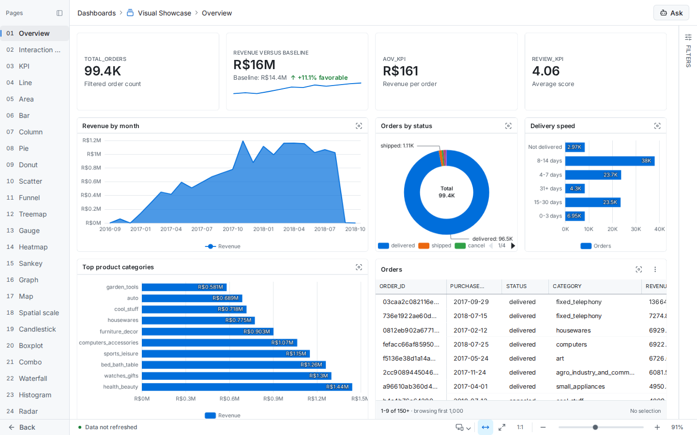

# LeapView

[](https://github.com/flidai/leapview/actions/workflows/ci.yml)
[](LICENSE)

LeapView is an open-source, agent-native BI platform. Build governed semantic
models and dashboards as code, review every change in Git, and explore the
same trusted analytics through interactive dashboards and AI agents.



## Why LeapView?

- **Analytics as code:** define models, metrics, dashboards, and access rules as
  version-controlled resources.
- **One governed layer:** dashboards and agents use the same metrics,
  permissions, and data.
- **Self-hosted:** run the Go application on your own infrastructure with
  DuckDB and DuckLake execution.
- **Built for existing data stacks:** connect databases, object storage, and
  open lakehouse formats without moving dashboard definitions out of Git.

## Try LeapView

The evaluation image is the quickest way to explore LeapView. It requires only
Docker—no source checkout—and includes a disposable sample workspace.

```sh
docker pull ghcr.io/flidai/leapview:latest
docker run --detach --name leapview-evaluate --init \
  --publish 127.0.0.1:8080:8080 \
  --volume leapview-evaluate:/var/lib/leapview \
  ghcr.io/flidai/leapview:latest evaluate
docker exec leapview-evaluate leapview evaluate first-login
```

Open <http://localhost:8080>, sign in with the one-time credentials, and choose
**Five-minute Sales Evaluation**. The named volume preserves the evaluation
across container restarts.

Evaluation mode is not a production configuration. Follow the
[installation guide](https://leapview.dev/docs/installation) to clean up the
evaluation, work from source, or prepare a durable instance.

To remove the evaluation, run `docker rm --force leapview-evaluate`. Also run
`docker volume rm leapview-evaluate` when you want to delete its persisted data.

## Documentation

- [Documentation](https://leapview.dev/docs)
- [Getting started](https://leapview.dev/docs/getting-started)
- [Build dashboards](https://leapview.dev/docs/guides/build)
- [Self-hosting](https://leapview.dev/docs/guides/operate/self-hosting)
- [Architecture](https://leapview.dev/docs/architecture)
- [CLI, API, configuration, and resource reference](https://leapview.dev/docs/reference)

The repository also contains a release-oriented
[Docker Compose package](deploy/compose/README.md) for self-hosted deployments.

## Development

Start the worktree-local development server:

```sh
task dev
```

Use `task dev:status`, `task dev:logs`, and `task dev:stop` to manage it. Run
focused Go and browser tests locally during iteration. Before a meaningful push, `task ci`
runs the fast pull-request contract locally. Every pull request runs the same contract on an
ephemeral GitHub-hosted runner, the merge queue runs `task ci:full` against the exact
candidate, and scheduled CI runs `task ci:nightly` daily. Use `task ci:pr` for fast local validation or
`task ci:local` (an alias for `task ci:full`) when the complete contract must run locally.
Read the [GitHub-hosted CI architecture](https://leapview.dev/docs/architecture/github-hosted-ci)
for trust, caching, execution, and operations boundaries.

See the
[repository and development workflow](https://leapview.dev/docs/contributing/repository)
for prerequisites, generation rules, architecture boundaries, and the full
contribution process.

## Project status

LeapView is under active development. Follow
[GitHub releases](https://github.com/flidai/leapview/releases) for published
versions and use the [issue tracker](https://github.com/flidai/leapview/issues)
for bugs and feature proposals.

## License

LeapView is available under the [Apache License 2.0](LICENSE).
