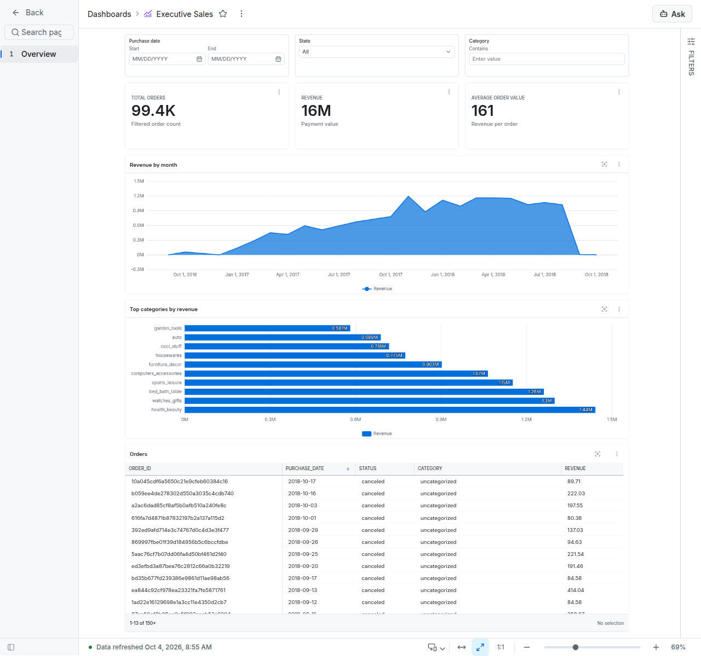
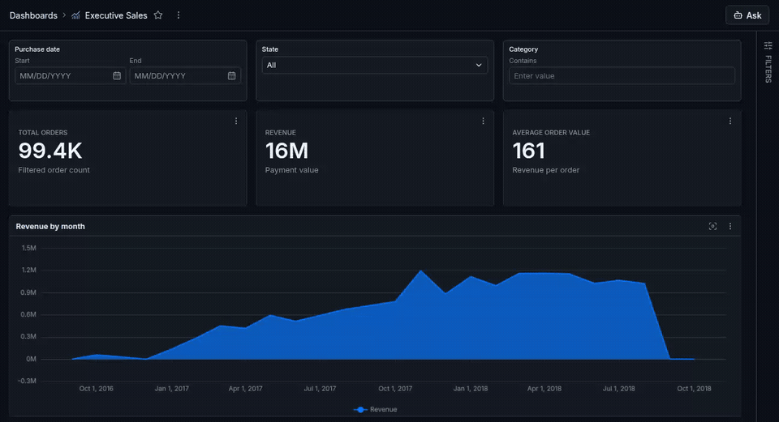
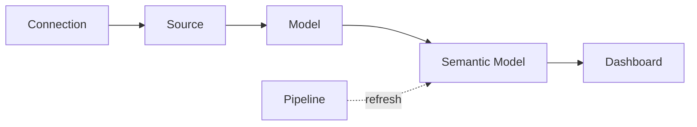

#  LeapView

**Define metrics in code. Explore them everywhere.**

LeapView is open-source business intelligence for teams who want their analytics
in Git and their data on their own infrastructure. Define a metric once, then use
it across interactive dashboards, APIs, and optional AI tools with governed access.

[Get started](#get-started) · [Documentation](https://leapview.dev/docs) · [Current alpha](https://github.com/flidai/leapview/releases/tag/v0.3.0-alpha.1) · [Contributing](docs/articles/contributing/repository.md)

[](https://github.com/flidai/leapview/actions/workflows/nightly.yml) [](https://github.com/flidai/leapview/releases/tag/v0.3.0-alpha.1) [](LICENSE)

<picture>
  <source media="(prefers-color-scheme: dark)" srcset=".github/assets/readme-executive-sales-dark.png">
  
</picture>

*Executive Sales, the repository's Olist-backed showcase, in a development build.
It is separate from the synthetic Sales overview starter created by the authoring CLI.*

<details>
<summary>Explore the full dashboard: category breakdown and orders table</summary>

<picture>
  <source media="(prefers-color-scheme: dark)" srcset=".github/assets/readme-executive-sales-full-dark.png">
  
</picture>

</details>

<details>
<summary>Watch a category filter update the dashboard</summary>



*Recorded in the development showcase. Enter `health_beauty` in Category to narrow
all views to health and beauty products; clear it to return to the overview.*

</details>

## Why LeapView?

- **Review analytics like code.** Version connections, transformations, semantic
  models, refresh pipelines, and dashboards in Git. Validate the resource graph
  before publishing a candidate to your instance.
- **Give every view the same metrics.** Reuse dimensions, relationships, and
  business calculations across dashboards, headless queries, and agent tools.
- **Explore without rebuilding.** Combine charts, maps, KPI cards, filters, and
  analytical tables, including matrices and pivots. The browser builder offers
  governed drafts, previews, and YAML export.
- **Keep access consistent.** Apply roles, resource grants, row filters, and
  column masks through the governed query layer, with OIDC sign-in and SCIM
  provisioning for identity management.
- **Run on your infrastructure.** Go serves the application, DuckDB executes
  queries, DuckLake manages analytical snapshots, and PostgreSQL stores control
  state and the DuckLake catalog. Connect supported databases, object stores,
  and files.

Semantic access rules can be versioned with models. Identities, attribute and
role assignments, resource-grant assignments, credentials, and publication state
belong to the target instance. Browser YAML export does not commit to Git.
See [authorization](https://leapview.dev/docs/security/authorization) for the boundaries.

Built-in AI is optional and requires a configured provider and credentials.
External clients use the deployment's OAuth-protected
[MCP endpoint](https://leapview.dev/docs/guides/integrate/mcp) for governed
catalog, query, documentation, and dashboard-authoring tools.

## Get started

Choose your starting point and what you want to have running:

- **Author analytics.** Get a local Docker runtime and the synthetic **Sales
  overview** starter. [Install the alpha CLI](deploy/local/INSTALL.md), then
  follow the [analytics development guide](docs/guides/cli/analytics-development.md).
- **Operate an instance.** Run LeapView on your infrastructure. Follow
  [Installation](docs/articles/start/installation.md) for the version-matched
  Compose package and external PostgreSQL/storage prerequisites.
- **Contribute to LeapView.** Build the application from source with the
  **Executive Sales** showcase. Follow the
  [contributor setup](docs/articles/contributing/repository.md), including
  authenticated sample-data setup.

CLI archives are published for Linux and macOS on AMD64 and ARM64. Check the
installation guide for host, Docker Compose, and
native credential-store requirements; package availability does not establish
that every host/provider workflow is qualified.

The current server release, **v0.3.0-alpha.1**, is for controlled evaluation.
Interfaces may change and workflows may be incomplete. The default branch and
its documentation can contain changes beyond that release. Use the
[release notes and exact artifacts](https://github.com/flidai/leapview/releases/tag/v0.3.0-alpha.1)
when evaluating a packaged version.

## One revenue definition, several views

Start with the deterministic **Sales overview** project created by the CLI.
Its [semantic model](internal/app/cli/projectinit/template/dashboards/semantic-models/sales.yaml)
defines revenue under `spec.datasets[name=sales].metrics`:

```yaml
- name: revenue
  type: simple
  empty: zero
  label: Revenue
  format: currency
  agg: sum
  field: amount
```

Its [dashboard](internal/app/cli/projectinit/template/dashboards/dashboards/sales-overview.yaml)
reuses that metric in a KPI under `spec.visuals`:

```yaml
- id: revenue
  type: kpi
  query: {type: aggregate, dimensions: [], metrics: [revenue]}
  presentation: {type: kpi, note: Synthetic revenue, tone: success}
```

The KPI shows the total. The monthly trend groups that revenue by month; the
category chart groups it by category. All three reference `revenue`, keeping the
calculation in the semantic model. These are excerpts; the linked files contain
the complete resources, including identity and layout.


```mermaid
flowchart LR
  accTitle: LeapView analytics resource flow
  accDescr: Connections identify inputs for Sources. Models transform Sources, Semantic Models define business meaning, and Dashboards present it. Pipelines orchestrate refresh for a Semantic Model.
  C[Connection] --> S[Source] --> M[Model] --> SM[Semantic Model] --> D[Dashboard]
  P[Pipeline] -. refresh .-> SM
```

## Explore further

- **Build:** [dashboard guides](https://leapview.dev/docs/guides/build),
  [visual catalog](https://leapview.dev/docs/visuals/overview), and
  [connector capabilities](https://leapview.dev/docs/reference/data-resource-connectors).
- **Integrate:** [headless BI](https://leapview.dev/docs/guides/integrate/headless-bi),
  [dbt's published relations and Parquet](https://leapview.dev/docs/guides/integrate/dbt-warehouse-boundary),
  and [semantic-model interchange](https://leapview.dev/docs/concepts/ossie-interchange).
- **Operate:** [self-hosting](https://leapview.dev/docs/guides/operate/self-hosting),
  [authorization](https://leapview.dev/docs/security/authorization), and
  [backup and restore](https://leapview.dev/docs/guides/operate/backup-restore).
- **Understand:** [architecture](https://leapview.dev/docs/architecture),
  [architecture decisions](adr/README.md), and
  [CLI/API/resource reference](https://leapview.dev/docs/reference).

## Contribute

After [setup](docs/articles/contributing/repository.md), use `task dev` for the
application and `task ci` for the local pull-request contract. `task playground`
opens the [component and chart workbench](playground/README.md) without application
services or a database. Toolchain and Nix instructions live in the contributor guide.

Report bugs and feature proposals through [Issues](https://github.com/flidai/leapview/issues).
Report vulnerabilities privately through the [security policy](SECURITY.md).

## License

LeapView is available under the [Apache License 2.0](LICENSE).
