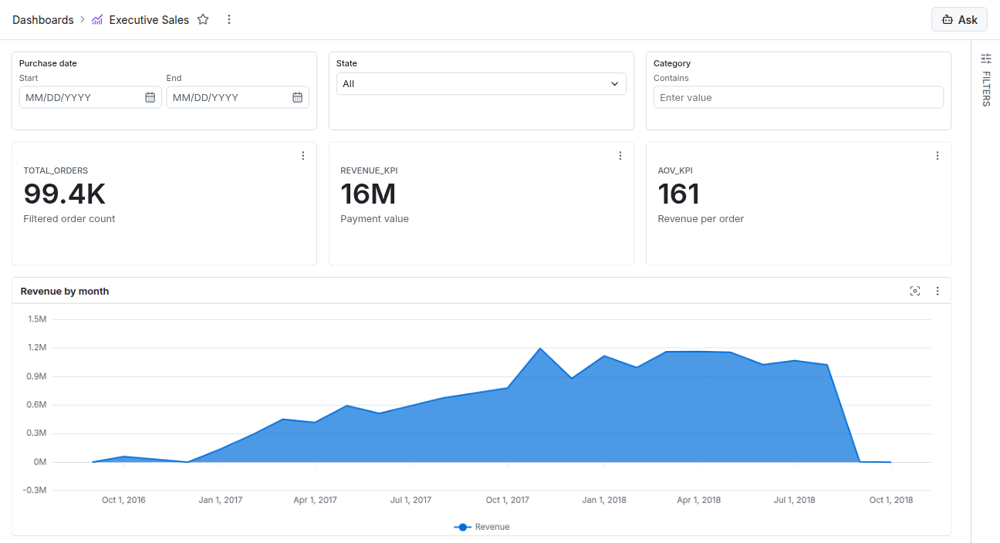
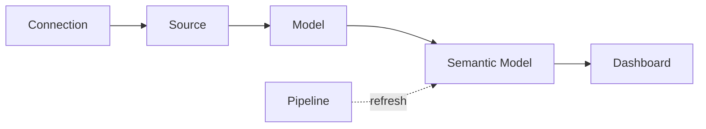

# LeapView

**Metrics your whole team can build on.**

Open-source business intelligence for defining metrics once, building interactive
dashboards, and asking questions through AI—all using shared semantic definitions
and governed access.

[Get started](deploy/local/INSTALL.md) · [Documentation](https://leapview.dev/docs) ·
[Current alpha](https://github.com/flidai/leapview/releases/tag/v0.3.0-alpha.1) ·
[Contributing](docs/articles/contributing/repository.md)

[](https://github.com/flidai/leapview/actions/workflows/nightly.yml)
[](https://github.com/flidai/leapview/releases/tag/v0.3.0-alpha.1)
[](LICENSE)

<picture>
  <source media="(prefers-color-scheme: dark)" srcset=".github/assets/readme-executive-sales-dark.png">
  
</picture>

*Executive Sales, the repository's Olist-backed showcase, in a development build.
It is separate from the synthetic Sales overview starter created by the authoring CLI.*

## Why LeapView?

- **Analytics as code.** Keep connections, transformations, semantic models,
  refresh pipelines, and dashboards in version control. Validate the resource
  graph and review changes before publishing a candidate.
- **One definition of your metrics.** Reuse dimensions, relationships, and
  business calculations across dashboards, headless queries, and agent tools.
  Semantic queries run through the governed query layer.
- **Interactive dashboards.** Build pages with charts, maps, KPI cards, filters,
  and analytical tables, including matrices and pivots. The browser builder
  creates governed drafts with previews and YAML export; exporting does not
  automatically commit a change to Git.
- **Access controls that follow the query.** Use roles, resource grants, row
  filters, column masks, OIDC sign-in, and SCIM provisioning. Semantic access
  rules can live in versioned model definitions; identities, attribute and role
  assignments, resource-grant assignments, and publication state belong to the
  target instance.
- **Run it on your infrastructure.** Go serves the application, DuckDB executes
  analytical queries, DuckLake manages analytical snapshots, and PostgreSQL
  stores control state and the DuckLake catalog. Connect supported databases,
  object stores, and files without putting credentials in portable analytics.

Built-in AI is optional and requires a configured provider and credentials.
External clients can connect to the deployment's OAuth-protected
[MCP endpoint](https://leapview.dev/docs/guides/integrate/mcp) to use governed
catalog, query, documentation, and dashboard-authoring tools.

## Get started

Choose the workflow that matches what you want to do:

| Goal | Starting point |
| --- | --- |
| Author analytics locally | [Install the alpha authoring CLI](deploy/local/INSTALL.md), then follow the [analytics development guide](docs/guides/cli/analytics-development.md). |
| Operate a self-hosted instance | Follow [Installation](docs/articles/start/installation.md) for the version-matched Compose package, external PostgreSQL control/DuckLake databases, and managed storage. |
| Develop LeapView itself | Follow the [contributor setup](docs/articles/contributing/repository.md), including authenticated sample-data setup. |

The authoring CLI packages a matching local Docker runtime and a small,
deterministic **Sales overview** starter. Linux and macOS archives are published
for AMD64 and ARM64. Check the installation guide for host, Docker Compose, and
native credential-store requirements; package availability does not establish
that every host/provider workflow is qualified.

The current server release, **v0.3.0-alpha.1**, is for controlled evaluation.
Interfaces may change and workflows may be incomplete. The default branch and
its documentation can contain changes beyond that release. Use the
[release notes and exact artifacts](https://github.com/flidai/leapview/releases/tag/v0.3.0-alpha.1)
when evaluating a packaged version.

## Define once, use throughout the dashboard

The starter's [semantic model](internal/app/cli/projectinit/template/dashboards/semantic-models/sales.yaml)
defines revenue under `spec.datasets[name=sales].metrics`:

```yaml
- name: revenue
  type: simple
  empty: zero
  label: Revenue
  format: currency
  agg: sum
  field: amount
```

Its [dashboard](internal/app/cli/projectinit/template/dashboards/dashboards/sales-overview.yaml)
reuses that metric in a KPI under `spec.visuals`:

```yaml
- id: revenue
  type: kpi
  query: {type: aggregate, dimensions: [], metrics: [revenue]}
  presentation: {type: kpi, note: Synthetic revenue, tone: success}
```

The monthly trend and category chart query the same metric. These are excerpts;
the linked files contain the complete resources, including identity and layout.


```mermaid
flowchart LR
  accTitle: LeapView analytics resource flow
  accDescr: Connections identify inputs for Sources. Models transform Sources, Semantic Models define business meaning, and Dashboards present it. Pipelines orchestrate refresh for a Semantic Model.
  C[Connection] --> S[Source] --> M[Model] --> SM[Semantic Model] --> D[Dashboard]
  P[Pipeline] -. refresh .-> SM
```

## Explore further

- **Build:** [dashboard guides](https://leapview.dev/docs/guides/build),
  [visual catalog](https://leapview.dev/docs/visuals/overview), and
  [connector capabilities](https://leapview.dev/docs/reference/data-resource-connectors).
- **Integrate:** [headless BI](https://leapview.dev/docs/guides/integrate/headless-bi),
  [dbt's published relations and Parquet](https://leapview.dev/docs/guides/integrate/dbt-warehouse-boundary),
  and [semantic-model interchange](https://leapview.dev/docs/concepts/ossie-interchange).
- **Operate:** [self-hosting](https://leapview.dev/docs/guides/operate/self-hosting),
  [authorization](https://leapview.dev/docs/security/authorization), and
  [backup and restore](https://leapview.dev/docs/guides/operate/backup-restore).
- **Understand:** [architecture](https://leapview.dev/docs/architecture),
  [architecture decisions](adr/README.md), and
  [CLI/API/resource reference](https://leapview.dev/docs/reference).

## Contribute

After [setup](docs/articles/contributing/repository.md), use `task dev` for the
application and `task ci` for the local pull-request contract. `task playground`
opens the [component and chart workbench](playground/README.md) without application
services or a database. Toolchain and Nix instructions live in the contributor guide.

Report bugs and feature proposals through [Issues](https://github.com/flidai/leapview/issues).
Report vulnerabilities privately through the [security policy](SECURITY.md).

## License

LeapView is available under the [Apache License 2.0](LICENSE).
