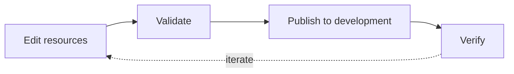

# Build your first dashboard

This source-checkout tutorial uses the Olist-backed Executive Sales project,
not the synthetic Sales overview project generated by `leapview init`. It
demonstrates the dashboard-as-code workflow. Make and validate a small change there before creating connections, Models, and semantic models from scratch.

## Before you begin

Complete the [contributor setup](https://github.com/flidai/leapview/blob/main/docs/articles/contributing/repository.md) and keep the
development target local. Use a branch where changing the example label and note is safe.

Follow one reviewable loop:

1. Confirm the unchanged sample dashboard works.
2. Trace the resources that compose it.
3. Change one semantic label and one dashboard note.
4. Validate the complete source root.
5. Deploy to development and verify the rendered behavior.



## Start the sample project

Prepare the Olist sample data and start the managed development server. The
development task provisions a worktree-local PostgreSQL service and admits
its local physical pool before publishing the sample candidate:

```sh
task dev
```

On a new database, the authenticated workflow creates its private credentials, stages the sample data, and publishes the project. Later starts reuse active managed data. The server writes worktree-local process state and logs beneath `.tmp/`. Open the URL printed by `task dev`, choose **Continue as Local Developer**, open the project resource browser, and choose **Executive Sales**. The shortcut creates an ordinary durable browser session; use `task dev:credentials` only when explicitly testing password login. Confirm that the KPI cards, revenue trend, category chart, filters, and orders table load before editing files.

## Trace the resources

The report is assembled from these files:

```text
dashboards/connections/olist.yaml
dashboards/sources/olist.*.yaml
dashboards/models/*.yaml
dashboards/semantic-models/sales.yaml
dashboards/pipelines/*.yaml
dashboards/dashboards/executive-sales.yaml
```

Read them from the outside in. The source-root loader discovers shared Olist inputs, Models, the `sales` semantic model, refresh pipelines, and dashboards into one graph. The dashboard refers to fields and metrics exposed by the `sales` semantic model.

## Change a semantic metric

Open `dashboards/semantic-models/sales.yaml`. Its `revenue` and `order_count` metrics are the inputs to the existing average-order-value metric:

```yaml
metrics:
  - name: aov
    type: ratio
    label: Average order value
    numerator: revenue
    denominator: order_count
    format: currency
```

For a first change, update only the label to `Average revenue per order`. This changes presentation metadata without changing the metric identity or formula. Stable IDs such as `aov` let dashboards and API clients continue referring to the same semantic field.

Validate the entire project, not just the edited file:

```sh
go run ./cmd/leapview validate --source-root dashboards
```

If validation reports a location, fix the resource before continuing. Common first-edit failures are incorrect indentation, an unknown field, or a reference to a semantic name that does not exist.

## Change the dashboard

Open `dashboards/dashboards/executive-sales.yaml`. Find the `aov_kpi` visual and change its note:

```yaml
visuals:
  - id: aov_kpi
    type: kpi
    query:
      type: aggregate
      dimensions: []
      metrics: [aov]
    presentation:
      type: kpi
      note: Average revenue per completed order
      tone: warning
```

The visual owns its semantic query and typed presentation. A page component later places that reusable visual on the grid by referencing `aov_kpi`.

## Validate and publish to development

Validate after your final edit, then let the managed development helper build
and publish to this worktree's target with its scoped credentials:

```sh
go run ./cmd/leapview validate --source-root dashboards
task dev:publish
```

For an explicit plan/build/publish workflow against another target, follow
[Develop, review, and publish](https://github.com/flidai/leapview/blob/main/docs/guides/cli/validate-deploy.md). Do not run
both publication paths for this tutorial.

## Verify the dashboard

Reload Executive Sales and confirm both label changes. Also change a date or state filter to verify that the KPI still participates in the shared query lifecycle.

LeapView validates the complete project graph before switching the active serving state. A rejected candidate does not replace the last valid serving state. This makes validation before publishing a normal part of authoring rather than recovery steps.

## Troubleshooting

If the dashboard does not change, confirm the deployment targeted the same local instance shown in the browser and inspect `task dev:logs`. If validation cannot find `aov`, verify that the metric ID was not renamed. If the KPI changes but filtering does not, compare its semantic query and interaction scope with the original definition before editing presentation code.

## Next steps

Revert or keep the example changes as appropriate for your branch, then continue with [Build dashboards](https://leapview.dev/docs/guides/build) for the complete workflow.
