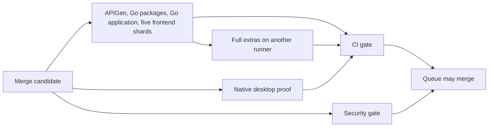
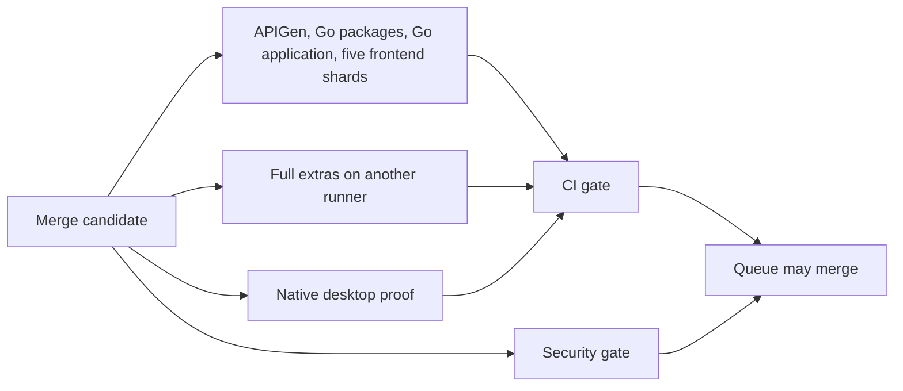

# CI health reporting semantics

Phase 2.1 of #520 repairs reporting only. Workflow execution, required checks,
selection policy, and thresholds are unchanged. The initial audit is in
[ci-health-audit.md](ci-health-audit.md).

## Previous behavior

`internal/app/tools/cireport/main.go` collected `ci.yml` and
`merge-validation.yml`. It normalized a historical subset of display names and
aggregated matrix conclusions. Missing plan artifacts called `inferPlan`, which
ignored observed results and returned `FullJobs()`. `internal/platform/ci/health.go`
then counted every legacy job as selected and classified any plan equal to
`FullJobs()` as full CI. Otherwise non-audit PRs were classified as selective.
Thus missing evidence manufactured both selection counts and execution categories.

Percentiles used nearest rank (`ceil(p * count) - 1`) over creation-to-update
seconds, including failures and cancellations. Reruns could include earlier
attempts and the time between attempts. Empty populations rendered as `0s`.
Selection percentages used all non-deferred runs as their denominator. The old
stack detector only recognized the retired monolithic PR validation job. Nightly
runs and current Go lane names were absent from collection/mapping.

Measured inputs were GitHub conclusions, job names, and timestamps. Planned jobs
came from artifacts when present; missing plans, full/selective classification,
and “all jobs selected” were inferred. Those inferences were not labeled.

## Version 2 reporting model

The reporter collects PR, merge-validation, and nightly workflows, including
nightly dependency security and vulnerability-evidence refresh jobs. It keeps
in-progress/incomplete records visible. API/network failures fail report generation;
job and artifact listings are paginated. Hitting the GitHub run search cap fails
explicitly instead of publishing a truncated window.

Execution categories and their duration samples are separate:

| Category | Evidence |
|---|---|
| `selective` | `ci.yml` PR with supported non-full, non-audit plan |
| `full_pr` | `ci.yml` PR with supported full plan or audit |
| `merge` | `merge-validation.yml` and `merge_group` |
| `nightly` | `nightly.yml` schedule or manual dispatch |
| `deferred` | PR gate success and complete observed stack-deferral job pattern |
| `unknown` | Missing/incompatible workflow metadata or PR planning evidence |

A known execution category does not imply complete evidence or successful checks.
For example, a merge run with no plan remains a merge latency sample but its
selection confidence is unknown. Failed or cancelled runs with complete timestamps
remain in their category's latency samples and their own conclusion counts.
Deferred stack runs are excluded from latency and rerun denominators.

`HealthReport.version` is 2. The existing JSON `full` field remains an alias for
**merge only** for structural compatibility; it must no longer be interpreted as
a combined PR/merge population. Historical JSON remains decodable. Unsupported or
unversioned plans are never upgraded implicitly. Version-1 plan artifacts remain
readable, including their legacy matrix names. Unknown artifact fields fail decoding
rather than silently authorizing a partial schema.

## Planning evidence versus observations

Each JSON run includes:

- `planned_jobs`: exact expected matrix members from a supported artifact, or null
  when evidence is missing/invalid/unsupported.
- `expected_jobs` and `expected_source`: a supported PR plan, or the centralized
  current exhaustive workflow registry for merge/nightly. A partial plan cannot
  redefine required merge/nightly jobs.
- `executed_jobs`: observed known non-skipped terminal job conclusions, including
  failures and cancellations; this is not a claim that every test step ran.
- `skipped_jobs`: observed skipped conclusions. A skip alone does not prove intent.
- `unknown_jobs`: missing expected jobs, unrecognized display names, or unknown
  conclusions. An unfamiliar name can count as executed and unknown simultaneously.
- `selection_confidence`: `unknown` without supported planning evidence;
  `verified` when supported planning evidence and expected results agree;
  `incomplete` when that evidence has mismatches or missing results.
- `problems`: expected-job failures/skips, missing/unknown evidence, timestamp and
  metadata limitations. `results` retains individual matrix results.

The planned-selection table counts supported plans only, with `planned_runs` as
its denominator. It does not claim that a planned job executed. A separate table
counts expected, executed, skipped and unknown jobs per run/matrix member. Missing
plans never increment planned-selection counts. The registry defines observational
identifiers and current exhaustive expectations; it is not a second selector and
is never consumed by a workflow gate.

Conclusions have separate success/failure/cancelled/skipped/unknown counters.
Timeout, startup failure and action-required conclusions count as failures. Unknown
conclusions, including neutral, remain unknown. `incomplete` is an overlapping
reporting-evidence/problem count, not an alternative to the failure count. The
report preserves GitHub's run conclusion even when job evidence contradicts it;
that contradiction appears in problems rather than rewriting GitHub's history.

## Time and thresholds

Latency is latest-attempt `run_started_at` to the latest job completion, using
attempt-scoped job results. Reruns fetch their attempt metadata explicitly. Queue
latency is attempt start to earliest non-skipped job start; it does not include
waiting before GitHub started the workflow attempt. The old creation-to-update
window is no longer a latency fallback. Missing/inconsistent timestamps use `-1`
in run JSON and are excluded from percentiles, not converted to zero. Reports show
sample counts, missing-duration counts, and `N/A` for zero-sample populations.
Nearest-rank p50/p95 calculations are unchanged.

Threshold values remain 12 minutes exhaustive/full, 6 minutes selective PR,
2 minutes queue, and 3% reruns. The 12-minute bound is applied independently to
merge, nightly, full PR and unclassified latency, so reclassification cannot hide
slow historical runs. Missing evidence and zero available runs generate explicit
report alerts. This also prevents the unchanged weekly workflow from closing #520
on an empty or incomplete report. Full health cannot be established until the
missing evidence is repaired; this reporting change alone will not clear the alert.

Audit sample counts accompany audit misses. A missing/non-successful lane added
by an audit is reported as a potential miss, not proof of a dependency mistake.
Zero misses with zero audit samples is not evidence of selector correctness.

## Phase 2.2 handoff and remaining limitations

- Reconnect the existing planner only after updating its schema for current lane
  names, required contracts, and matrix membership. Phase 2.1 left the legacy version-1 model intact; Phase 2.2 below adds the current
  PR projection without changing merge execution.
- Publish artifact provenance tying a plan to workflow, commit, and attempt.
  GitHub artifacts are run-scoped; a rerun's legacy plan is conservatively
  untrusted because it might belong to an earlier attempt. Version-2 plans carry
  candidate/run/attempt identity, which the reporter checks.
- The display-name registry is centralized in `health_jobs.go`. Its tests read
  the actual three workflow files and verify all lanes and matrix members. Old
  monolithic layouts may remain recognizable but incomplete against the current
  exhaustive inventory; unsupported layouts are not silently declared complete.
- The reporter observes GitHub conclusions, not test inventories or runtime
  attestation. It cannot independently prove that an intentionally skipped job
  was irrelevant or that a workflow's command body preserved coverage.
- The separate `security.yml`, Electron proof, image/release and deployment
  workflows are outside this report's three-workflow collection. Nightly's own
  security/evidence lanes are included. Merge gate latency includes its wait for
  Electron proof, without attributing that time to individual external jobs.
- Full workflows remain exhaustive. No runtime improvement is expected from
  reporting changes alone; selective reconnection and execution optimization
  remain separate work.

## Phase 2.1 validation

Regression tests were added first and failed on missing reporting fields, modern
lane recognition, hidden timeout conclusions, and empty reports claiming health.
After implementation:

- `go test -race ./internal/platform/ci ./internal/app/tools/cireport ./internal/app/tools/ciplan` passed.
- `go test ./internal/platform/architecture -run 'Test.*(CI|ContinuousIntegration|GitHub|Workflow)' -count=1` passed after generating required local build inputs.
- `git diff --check` passed; no workflow or planner/gate source changes.
- `task ci` passed generation, documentation validation, asset builds, sqlc
  determinism/vet/diff, generated-leaf compilation, and SQL call-site auditing.
  It then failed at `TestSQLCVetPreparesAgainstBaselinePostgreSQL18` because this
  environment cannot access `/var/run/docker.sock`. The full contract did not pass.

The audit and reporting notes live beside the CI implementation because `docs/`
is the public site source and rejects unregistered internal documents. The prior
`docs/ci-health-audit.md` artifact was moved here, with diagram accessibility
metadata added. No public navigation or workflow behavior was changed.

## Phase 2.2: selective PR execution

The audit mapping used for reconnection is:

| Existing planner output | Current PR lane | Status |
|---|---|---|
| `prepare`, `frontend_prepare` | Preparation inside selected jobs | Asset requirements, not change detection; full preparation retained |
| `go_tests`, `go_matrix` | Go packages and Go application | Adapted conservatively to both, including source-inventoried external-service tests |
| `frontend_tests`, `frontend_matrix` | Frontend matrix | Adapted to current `shard` key and exact member validation |
| `docs`, `site_image` | Docs validation and site frontend shard | Adds focused docs/site Go and public-contract coverage |
| none | APIGen | Full/cross-cutting and APIGen module changes |
| Go/deployment selection | PostgreSQL isolation, dbt boundary, spatial benchmarks | New explicit PR lane flags; conservative backend closure |
| `ui_route_qa` | All PR browser consumers | Merge-only route QA stays in its unchanged workflow |
| `go_analysis`, `go_vuln`, `node_audit` | No equivalent PR CI job | Existing merge/nightly/security workflows retain ownership |
| `production_image`, `deployment_contracts` | Backend qualification where relevant | Image publication and exhaustive deployment proof remain unchanged |

Version-2 plans retain historical classification fields and add a typed `pr`
projection, with nominal/effective current jobs, exact diff base, tested candidate,
run ID, attempt and explicit stack deferral. This is an adapter to the existing
classifier, not an additional workflow path-filter system. Unknown paths, empty
diffs, shared contracts, generators, APIGen, build inputs and manual dispatch run
the complete PR tier. `ci:full` and the deterministic one-in-five PR audit remain.
Label changes trigger replanning.

PR flow: `prepare` (planner only) -> selected validation jobs -> always-present
`CI gate`. Security gate continues independently without changes. No merge or
nightly workflow is modified. Selected jobs still use full preparation and all
of their existing validation commands.

Standalone PRs compare the event base commit with `GITHUB_SHA`, the candidate
actually checked out and tested. Stack PRs use the merge base of that candidate
and the fetched default branch, so lower-layer changes participate. For stacks
based elsewhere this is a conservative broader diff. Full checkout history and
commit resolution are mandatory; resolution errors fail planning. Diff records
remain NUL-delimited and include both rename paths and deleted paths.

Lower stack layers still defer to the tip, but deferral is an explicit artifact
field checked against the event-derived gate input. All required lane results must
be present: selected lanes succeed, unselected lanes skip, and planning succeeds.
The gate rejects unsupported plans, stale candidate/run/attempt identities,
unexpected result keys, invalid shards and frontend matrices differing from the
plan. Job-level conditions apply uniformly before matrix expansion; no per-shard
skip conditions exist. Gate and workflow tests retain that contract.

Reporting compatibility is extended only to read the new schema and provenance,
recognize the planner/docs jobs, and expand planned frontend members. Historical
version-1 artifacts remain readable; missing/incompatible evidence remains unknown.
The artifact name remains `ci-plan`; reruns overwrite it, and consumers verify
its embedded attempt identity rather than trusting its name.
Use **Re-run all jobs** when retrying a PR run: retrying only failed jobs can retain
the earlier successful planning job and its artifact, which the gate deliberately
rejects as belonging to a different attempt.

Expected impact: docs/frontend PRs avoid the observed 16-minute package and
21–22-minute application lanes. Current full preparation suggests roughly 6–10
minutes for selected browser/docs work plus planning/gate overhead, subject to
hosted measurements. Backend changes remain conservative and can still take
21–22 minutes. Audits and cross-cutting changes still run the full PR tier, so
an overall p95 below 12 minutes is not promised by this change.

Phase 2.3 should measure hosted selection accuracy, queue/setup/preparation costs,
and test-lane critical paths before further optimization. Production frontend
changes conservatively run all browser shards because cross-feature imports exist;
only a proven dependency graph should narrow those further. Docs validation uses
the existing complete docs/site task alongside the site shard; preparation and
browser overlap can be measured before safely deduplicating it. Exhaustive merge
runtime remains outside Phase 2.2.

### Phase 2.2 validation

- Planner, gate, CLI and reporting tests passed with the race detector, including
  cumulative stack diffs, rename/delete selection, missing history, planner
  failure, stale artifacts, deferral and frontend matrix integrity.
- Related CI/workflow architecture tests passed. Frontend workflow contract tests
  passed (4 tests, 25 assertions).
- Representative local planner runs selected backend lanes for backend changes,
  core/chat shards for chat test changes, docs plus the site shard for docs changes,
  and every PR lane for shared contracts and unknown paths.
- Actionlint 1.7.7 passed with shellcheck disabled and only the pre-existing
  unsupported `stacked` event diagnostic excluded. The same diagnostic was
  reproduced against the original workflow; shellcheck is unavailable locally.
- `git diff --check` passed. Merge, nightly and security workflow diffs are empty.
- `task ci` passed generation, documentation, assets and initial SQL checks, then
  failed at `TestSQLCVetPreparesAgainstBaselinePostgreSQL18` because Docker socket
  access is denied in this environment. The full local contract has not passed.
- Hosted execution and resulting latency percentiles remain to be measured.

## Phase 2.3: merge dependency barrier

Follow-up: [hosted critical-path measurements](ci-critical-path-measurement.md)
verify rollout status, seven-day percentiles, command timings and ranked next
steps. They explicitly separate measured hosted results from local-change projections.

The merge workflow's `full-validation` job used to wait for APIGen, Go packages,
Go application and all five frontend shards. It consumes no job outputs or
artifacts from those jobs: it checks out the same candidate on its own hosted
runner, installs its toolchain and runs `ci:prepare` itself. That dependency was
a scheduling barrier, not a data dependency.

Before:

After:

Only the full job's `needs` barrier is removed. Names, runner types, repository
guards, timeouts, matrix members, validation commands, proof polling and gate
dependencies are unchanged. The final gate still uses `always()` and demands
`success` from every expected job; skipped, failed, cancelled and missing results
block merging. Native proof remains tied to the exact SHA and `merge_group`
event. The independently required Security gate is unchanged.

### Resource and coverage audit

| Lane / contract | Scheduling and resource findings | Decision |
|---|---|---|
| APIGen; Go packages; Go application; frontend shards | Separate ephemeral runners; no cross-job outputs; frontend has five members and fail-fast disabled | Retain every lane and command |
| Full extras | Own checkout, toolchain, Chromium, Terraform and generated/embedded assets; no downloaded base artifacts | Start alongside base jobs |
| Full extras command sequence | Desktop tests, vet, package races, critical-package races, workload qualification, PostgreSQL multinode, UI QA, deployment checks, MinIO and lifecycle/GC conformance | Preserve complete sequence; individual command timing does not yet justify a split |
| Container and UI fixtures | Runner-local Docker, generated files, browser processes and test services; same-runner concurrency could collide or exhaust CPU/RAM | Parallelize only independent hosted runners; preserve bounded local execution |
| Caches | Shared setup action restores correctness-independent caches; each job prepares its own inputs | No artifact handoff or cache-hit dependency introduced; concurrent cold misses may cost more |
| Native proof and security | Separate workflows triggered for the candidate; CI gate waits for native proof; Security gate remains independently required | Preserve both requirements |
| Nightly | Base jobs still precede full extras; dependency security and evidence refresh are independent and required by its gate; agent evaluation remains diagnostic | Audited, unchanged in this merge-only change |
| Local Taskfile | `ci:full` still runs `ci:pr` then extras; `ci:nightly` adds security afterward | Only clarify the extras description; no task commands change |

Full extras now also executes when a base job fails. This uses more runner time on
failed candidates, but preserves exhaustive diagnostics; the gate still fails.
Peak merge validation runner demand increases from eight to nine, excluding the
separate security/native workflows. Account concurrency limits and cache contention
can therefore reduce the elapsed-time benefit.

### Timing evidence and measurement limit

Job timestamps were re-read through the GitHub Actions API on 2026-09-08:

| Successful merge run | Observed elapsed | Go application duration | Full extras duration | Projected parallel work critical path, excluding queue/gate overhead |
|---|---:|---:|---:|---:|
| [34184865005](https://github.com/flidai/leapview/actions/runs/34184865005) | 43m27s | 21m15s | 21m57s | 21m57s |
| [34192266679](https://github.com/flidai/leapview/actions/runs/34192266679) | 43m42s | 21m57s | 21m30s | 21m57s |
| [34193138871](https://github.com/flidai/leapview/actions/runs/34193138871) | 36m48s | 20m14s | 16m17s | 20m14s |

In run 34184865005, full validation started at 04:11:20 UTC, after the application
lane finished at 04:11:16, although the run began at 03:49:57. Its extras command
took 15m12s; setup/preparation/cleanup consumed the rest of its 21m57s. The
[native proof](https://github.com/flidai/leapview/actions/runs/34184865029)
had already succeeded by 03:53:46, so it was not that run's critical path.

The scheduling model changes from `max(base) + full + gate` to
`max(base, full, native proof readiness) + gate`, with the separate Security gate
also required before merging. At unchanged job durations and available runners,
these samples suggest approximately 20–22 minutes plus overhead, a roughly
45–50% improvement. **Measured after-change elapsed time is not yet available:**
the local workflow edit has not executed in the hosted merge queue. The table is
a projection from measured old jobs, not an after-change benchmark or p95 claim.

After rollout, compare first-attempt successful runs' job start/end timestamps,
queue delay, exact-SHA native proof completion and Security gate completion. Check
that full extras starts alongside base lanes, then collect a complete trailing
window before assessing p95. Remaining bottlenecks are the application lane,
sequential full extras, repeated preparation and possible runner/proof queues.
Reaching 12 minutes still requires measured profiling and coverage-preserving
splits of those contracts; this change does not claim to meet that target.

### Phase 2.3 validation

- The new merge workflow regression test first failed on the existing dependency
  barrier, then passed after removal. It verifies independent lanes, self-contained
  preparation, exhaustive gate dependencies, exact-candidate native proof wiring,
  and executes the actual gate shell script against success and every lane's
  failure/cancellation/skip/missing-result cases.
- CI/planner/reporter tests passed with the race detector; related CI/workflow
  architecture tests and all four frontend workflow contract tests passed.
- Actionlint 1.7.7 passed for `merge-validation.yml` without diagnostic exclusions;
  shellcheck was disabled because it is unavailable in this environment.
- `git diff --check` passed. The merge workflow diff removes only the dependency
  barrier and adds its explanation. The Taskfile diff changes only the extras
  description. Nightly, security and Electron proof workflows are unchanged.
- `task ci` was rerun: generation, docs/assets, SQL determinism/vet/diff,
  generated-leaf compilation and SQL auditing passed. Required PostgreSQL 18
  conformance then failed because `/var/run/docker.sock` access is denied.
  The full local contract did not pass; no validation was disabled to bypass it.
