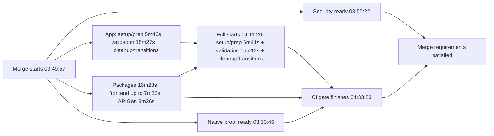

# Hosted CI critical-path measurement — #520

Measured 2026-09-08. This report follows the local Phase 2.1–2.3 changes described
in [README.md](README.md). It does not change CI reporting semantics or thresholds.

## Result and rollout status

**Hosted successful first-attempt merge p95 is 44m40s, not 20–22 minutes.**
The 20–22-minute figure was a scheduling projection. Every one of the 100 merge
candidates in the measured seven-day window still contains the base-to-full
dependency barrier. The local removal has no hosted sample in this population.

| Population | Count | p50 | p95 |
|---|---:|---:|---:|
| Successful first-attempt merge runs, seven-day window | 69 | 39m06s | 44m40s |
| Completed first-attempt merge runs with valid elapsed timestamps, including failures/cancellations | 96 | 36m02s | 44m40s |
| Successful first-attempt runs with modern five-frontend-shard layout | 12 | 43m26s | 44m54s |
| Hosted runs containing Phase 2.3 barrier removal | 0 | unavailable | unavailable |

The full collection has 70 successes, 26 failures, two cancellations and two
in-progress runs at discovery. One successful rerun is excluded from headline
percentiles to avoid mixing attempts. The window is
`2026-09-01T07:40:01Z..2026-09-08T07:40:01Z`, selected by run creation time.
Details were collected afterward; runs incomplete at discovery stay excluded.
One cancelled run has a job completion preceding its start and is excluded from
elapsed metrics. Reused jobs in the rerun also have invalid queue timestamps;
those queues are unavailable rather than clamped to zero. Neither anomaly affects
the successful first-attempt headline.
The 12-run subset controls for the frontend layout change, but its source and
test inventories still evolve. Its nearest-rank p95 is its maximum, not a stable
long-term estimate. The older monolithic frontend population is kept separate.

**Measured after-change p95: unavailable.** No new execution optimization is
introduced by this measurement pass. Applying further splits before measuring the
already-prepared change would mix interventions and obscure their actual effect.
The highest-priority action is to roll out the existing change and obtain a
post-remediation baseline; that does not require inventing another optimization.
The user confirmed that remediation has not been deployed and directed this pass
to finish with local validation only. Hosted after-change measurement follows a
future pushed PR/merge candidate; this pass does not publish or enqueue it.

## Evidence and definitions

[Machine-readable evidence](measurements/2026-09-08.json) contains all 100 candidate
SHAs, workflow-barrier checks, latest-attempt job timing records, percentile
summaries, command timing samples, PostgreSQL package durations, and matched
security/native-proof runs. It contains no downloaded raw logs or credentials.

Collection used read-only GitHub REST calls through `gh api`:

```text
GET /repos/flidai/leapview/actions/workflows/merge-validation.yml/runs
    ?event=merge_group&created=2026-09-01T07:40:01Z..2026-09-08T07:40:01Z
    &per_page=100&page=N
GET /repos/flidai/leapview/actions/runs/{run}/attempts/{attempt}/jobs
    ?per_page=100&page=N
GET /repos/flidai/leapview/contents/.github/workflows/merge-validation.yml?ref={candidate_SHA}
GET /repos/flidai/leapview/actions/jobs/{job}/logs
GET /repos/flidai/leapview/actions/workflows/{security.yml|electron-security-proof.yml}/runs
    ?head_sha={candidate_SHA}&event=merge_group
```

Run/job pagination was exhausted. Each candidate's workflow was read at its SHA,
rather than assuming the current branch's YAML ran historically. An example is
[candidate 3140c97c's workflow](https://github.com/flidai/leapview/blob/3140c97c272c018389ee8fd2e1594376463a88f3/.github/workflows/merge-validation.yml),
which still declares the full job's dependency on all base lanes.

- Elapsed time: latest job completion minus `run_started_at`, for first attempts.
  It is workflow latency, not time waiting for admission to the merge queue.
- Runner queue: job `started_at - created_at`. GitHub creates the full job after
  prerequisites complete; the preceding dependency wait is reported separately.
  This is the API-visible scheduling delay, not an internal runner scheduler trace.
- Checkout, setup, preparation, validation and cleanup use completed step
  timestamps. Composite toolchain setup is one API step. Validation includes test
  commands, generated checks and qualification commands; it is not pure test CPU time.
- Cleanup comprises `Post ...` and `Complete job`. Residual runner transitions are
  retained as `unattributed`, typically a few seconds, rather than hidden in tests.
- Command intervals use timestamped Task log markers inside serial task sequences.
  They include Go compilation, subprocess startup and intervening dependencies;
  concurrent Go package output cannot identify each package's wall-clock start.
- Quantiles use the existing nearest-rank convention, `ceil(p*n)`. Column p95s
  are separate distributions and must not be added together.

## Job breakdown

Modern five-shard successful cohort, 12 runs per row. Values are **p50 / p95**.

| Lane | Runner queue | Checkout | Setup | Preparation | Validation commands | Cleanup | Total job |
|---|---:|---:|---:|---:|---:|---:|---:|
| Go application | 3s / 7s | 5s / 7s | 1m51s / 2m01s | 4m02s / 4m13s | 15m27s / 16m01s | 1s / 1s | 21m15s / 22m25s |
| Go packages | 3s / 5s | 6s / 8s | 1m51s / 2m07s | 4m03s / 4m13s | 10m22s / 13m28s | 1s / 3s | 16m30s / 18m20s |
| Full extras | 3s / 5s | 6s / 9s | 2m22s / 3m18s | 4m05s / 4m20s | 15m09s / 15m41s | 1s / 5s | 21m58s / 22m36s |
| Frontend core | 3s / 4s | 6s / 8s | 2m06s / 2m22s | 4m01s / 4m06s | 39s / 39s | 1s / 2s | 6m53s / 7m16s |
| Frontend reports | 3s / 4s | 6s / 8s | 2m08s / 2m21s | 3m58s / 4m16s | 46s / 52s | 1s / 2s | 6m58s / 7m38s |
| Frontend chat | 3s / 4s | 6s / 9s | 2m12s / 4m33s | 3m59s / 4m50s | 16s / 18s | 1s / 1s | 6m32s / 9m54s |
| Frontend data | 3s / 4s | 6s / 8s | 2m11s / 2m24s | 4m03s / 4m19s | 35s / 38s | 1s / 2s | 6m59s / 7m31s |
| Frontend site | 3s / 39s | 6s / 10s | 2m07s / 2m28s | 4m02s / 4m24s | 47s / 50s | 1s / 2s | 7m04s / 7m36s |

Frontend preparation dominates its test execution, but no frontend shard is the
current merge critical path. Removing browser preparation alone would therefore
save runner time and PR latency, not the current merge p95.

The seven-day maximum, [run 33854146671](https://github.com/flidai/leapview/actions/runs/33854146671),
was 59m00s. Its application preparation took 13m51s and full preparation 11m27s;
job queues were only 3–4 seconds. Preparation tail/retry behavior needs a separate
investigation before treating warm-cache medians as a latency guarantee.

## Command-level bottlenecks

Three most recent successful merge runs at collection:
[34193138871](https://github.com/flidai/leapview/actions/runs/34193138871),
[34192266679](https://github.com/flidai/leapview/actions/runs/34192266679), and
[34184865005](https://github.com/flidai/leapview/actions/runs/34184865005).
Ranges below are sample minima/maxima, rounded to seconds; they are not p95s.

| Application command group | Observed interval |
|---|---:|
| Four app shards, three processes on one runner | 2m15s–2m37s |
| App MinIO integration | 8–11s |
| Source-inventoried PostgreSQL conformance, `-p 2` | 12m24s–12m55s |

All three logs report 52 PostgreSQL package completions. Summed reported package
test time is 1,385–1,424 seconds, while the lane takes 744–775 seconds. That is
consistent with the existing bounded two-package execution. The slowest reported
packages are `internal/app` (173–188s), `internal/app/deploymentpostgres`
(143–144s), `internal/analytics/ducklake/postgres` (101–111s),
`internal/deployment/postgres` (99–106s), and `internal/access/postgres` (88–91s).
These are package test durations, not isolated hosted-job forecasts.

Moving just the small application shards away from PostgreSQL can remove about
2m15s–2m37s from that lane, but PostgreSQL plus its own setup/preparation still
exceeds 12 minutes. Splitting the 52-package inventory across isolated runners is
more promising than increasing contention on one runner. It must retain the
source-derived inventory, flags, required-container setting and exact once-only
package coverage, with explicit checks for omissions and duplicates.

| Full extras command group | Observed interval |
|---|---:|
| Desktop tests/build | 2–3s |
| Go vet | 36–57s |
| `pkg/...` race tests | 37–55s |
| Critical-package race qualification | 2m10s–3m42s |
| Workload qualification | 23–27s |
| PostgreSQL multinode qualification | 29s |
| UI route/visual QA including managed server lifecycle | 3m47s–5m09s |
| Deployment contracts | 48–53s |
| MinIO pool conformance | 8–9s |
| Lifecycle/GC conformance | 2m18s–2m26s |

There are several substantial sequential groups, not one test that explains the
entire full-extras duration. A possible future decomposition is static/race,
UI QA, and container/deployment/lifecycle qualifications, each retaining complete
task targets and its own inputs. The existing `Full merge validation` check name
would need to remain as a strict aggregate if execution moves into child jobs.

Go packages will become another barrier if only application and extras improve:
its modern-cohort job p95 is 18m20s. In the newest successful package log,
SQL verification/conformance takes approximately 2m21s, quality checks 45s,
and the source-filtered package sweep 6m40s, on top of preparation/setup.
That one log is insufficient to choose a stable package partition.

## Database, security and proof lanes

Separate PR examples
[34197919951](https://github.com/flidai/leapview/actions/runs/34197919951),
[34197903083](https://github.com/flidai/leapview/actions/runs/34197903083), and
[34195462285](https://github.com/flidai/leapview/actions/runs/34195462285):

| PR lane | Queue | Total job | Toolchain setup | Other validation steps |
|---|---:|---:|---:|---:|
| PostgreSQL topology isolation | 3–4s | 3m13s–3m41s | 1m42s–2m07s | 1m19s–1m24s |
| dbt physical contract | 2–4s | 8m16s–8m35s | 1m53s–1m59s | 6m08s–6m31s |
| Spatial benchmarks | 3–4s | 2m43s–3m01s | 1m45s–2m02s | 49s |

The dbt validation column includes Python dependency installation. These are PR
lanes, not additional independent merge jobs. PostgreSQL topology isolation is
not interchangeable with the 52-package PostgreSQL conformance inventory.

For the three merge command samples, security and Electron proof runs were matched
by exact SHA and `merge_group` event. Security completed 5m23s–5m32s after merge
workflow creation; native proof completed after 3m44s–4m10s. Security job queues
were 2–3s, native-proof queues 2–17s. No matched proof/security failure or long
queue occurred. For example, [native proof 34184865029](https://github.com/flidai/leapview/actions/runs/34184865029)
finished at 03:53:46, while merge validation finished at 04:33:23.
This is a three-candidate diagnostic sample, not a security/proof queue p95.
Both required proof paths must remain unchanged.

## Critical-path diagram

Measured [run 34184865005](https://github.com/flidai/leapview/actions/runs/34184865005):



The dependency delay before full-job creation is 21m19s; its actual runner queue
is only 4s. Confusing these would incorrectly prioritize runner capacity.

For the 12 modern-layout samples, replacing the serial barrier with
`max(base/full job durations + observed runner queues) + gate queue/duration`
projects a p95 of **22m48s**. This model excludes event-dispatch overhead and
assumes unchanged job durations, available runners and no newly critical proof
wait. It is neither measured post-remediation p95 nor a promise of that latency.

## Ranked optimization decisions

Ranked by likely elapsed-time benefit, then risk and implementation complexity.
Savings below are conditional, not additive; improving one parallel lane can
leave another lane on the critical path.

| Rank | Action | Expected effect | Risk / complexity | Decision |
|---|---|---|---|---|
| 1 | Roll out the already-prepared dependency removal | Model changes modern sample p95 from 44m54s to 22m48s | Low implementation risk; higher concurrent runner/cache demand | Measure this first; no additional code needed |
| 2 | Partition full extras into independently prepared contract groups | Could cut its 21–23m lane to roughly 11–14m; application/packages then dominate | Medium/high: generated inputs, UI/server lifecycle, strict aggregate and failure artifacts | Candidate for a measured follow-up after rollout |
| 3 | Isolate and shard the source-derived PostgreSQL inventory | Reduce its 12–13m command budget toward 4–7m plus setup/preparation; full/packages must also improve | Medium/high: prove inventory union/disjointness, exact tags/flags, container isolation and shard balance | Strongest application-lane candidate; benchmark before selecting shard count |
| 4 | Separate SQL/quality contracts from the Go package sweep | About 3m of serial work in one log could overlap; further package profiling needed | Medium: preserve source-based exclusions, generated verification and quality coverage | Gather more package command profiles before partitioning |
| 5 | Reduce repeated generation/toolchain preparation | Typical preparation is ~4m per runner; tail can exceed 11m | High: immutable candidate/platform artifacts, generated-drift checks, native dependencies, cache integrity | Investigate tail and artifact-transfer costs; do not assume cache hits |
| 6 | Move app shards away from the external-service lane alone | Removes only ~2.3–2.6m from application; PostgreSQL still exceeds target | Medium: new job/aggregate and duplicated preparation | Insufficient standalone optimization |
| 7 | Optimize frontend/proof queues or raise per-runner concurrency | Little current merge critical-path benefit in measured samples | Resource contention and proof safety risk | Do not prioritize |

There is evidence for where to investigate, but no evidence that one additional
split alone will achieve the target. Full extras, PostgreSQL and Go packages all
need to fit within the remaining budget. Decompositions must preserve existing
check names, exhaustive gates, all task commands and security/native proof paths.

## Validation and next measurement

- Audited 100 candidate workflow definitions and exhausted run/job pagination.
- Recomputed nearest-rank percentiles from saved job completion timestamps;
  verified counts, phase totals and modern-layout population membership.
- Cross-checked sampled Task log intervals with API validation-step intervals.
  PostgreSQL inventory has 52 reported package completions in each sampled log.
- No new workflow, planner, gate, Taskfile, test-selection or reporting changes were
  made in this measurement pass. Existing uncommitted Phase 2.1–2.3 changes remain.
- Added this report, its evidence snapshot, and a README reference. Local evidence
  validation checks counts, timestamp anomalies, phase sums, percentiles, source
  links and exact-SHA proof matching. `git diff --check` passed.
- Revalidated the local remediation: CI/planner/reporter race tests, related
  CI/workflow architecture tests, and four frontend contract tests passed.
  Actionlint passed for PR, merge and nightly workflows with the existing
  unsupported `stacked` event diagnostic excluded and unavailable shellcheck
  disabled. Full `task ci` previously stopped at required PostgreSQL conformance
  because Docker socket access was denied; this pass does not claim that full
  contract passed or repeat it under the same known environment limitation.

After a hosted run containing the barrier removal exists, verify full/base overlap
and compare exact candidate job durations and proof readiness. Then collect a
complete trailing window using the same attempt/population policy before reporting
an after p95. Instrument or profile the intended group before each subsequent
split, prove unchanged coverage, and measure its actual marginal critical-path
benefit. The below-12-minute p95 target remains open.
