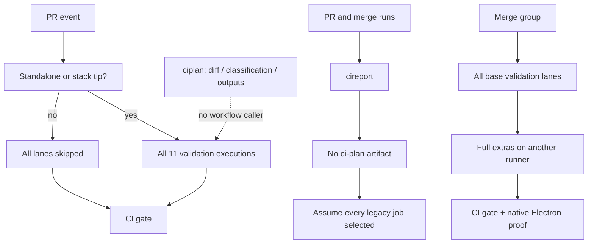
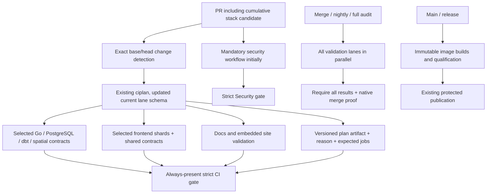

# CI health audit — issue #520

Audit date: 2026-09-08. Source revision: `3b201d716`.
Status: audit and implementation proposal; CI configuration has not been changed.

## Executive summary

[Issue #520](https://github.com/flidai/leapview/issues/520) reports 547 runs,
249 successes, 118 failures, 180 cancellations, and full-CI p50/p95 of
18m46s/41m11s against a 12-minute p95 limit. There are two separate problems:

1. **Selection is disconnected.** `internal/platform/ci/planner.go` and the
   `ciplan` command remain, but no current workflow invokes them. The workflow
   replacement in commit `e63811d5d` (2026-08-03, “ci: migrate LeapView to Autback”)
   removed the producer and consumers. Current hosted PR jobs only test stack
   position, not affected components. Subsequent workflow changes did not restore
   selection. Reconnecting the old outputs verbatim would miss newer contracts.
2. **The reporter fabricates legacy selection and mixes validation tiers.**
   `cireport.inferPlan` ignores actual job results and assigns `FullJobs()` whenever
   the `ci-plan` artifact is absent. Consequently every legacy job appears selected
   in every run, including production/site images and security scans that are not
   jobs in today's PR workflow. Both PR and merge runs enter the “full” population.

The runtime breach is nevertheless real. Three recent successful merge runs took
43m13s–44m08s. A 21–22-minute application lane precedes another 20–22-minute full
validation lane. Selection reduces irrelevant PR work, but cannot by itself bring
exhaustive merge validation below 12 minutes. Removing the unnecessary dependency
barrier predicts approximately 22 minutes for those samples; reaching 12 requires
additional measured splitting of Go tests, external-service tests, and full extras.
Do not change the threshold or close #520 merely because reporting is corrected.

## Evidence and limitations

Read all 17 workflow definitions, the shared setup action, Taskfile CI/test tiers,
planner/gate/reporter implementations and tests, architecture contracts, embedded
docs/site inputs, and repository history. Read live issue, ruleset, workflow runs,
job steps, and representative failed image-build logs using authenticated `gh`.

The [active main ruleset](https://github.com/flidai/leapview/rules/19956950)
requires **CI gate** and **Security gate** from GitHub Actions, strict status checks,
and the merge queue. Classic branch protection returned 404; the ruleset request
succeeded. No rules or repository settings were modified.

Timing samples below are the three newest successful runs among 30 recent runs per
workflow, fetched during the audit. They are diagnostic samples, not a replacement
seven-day percentile calculation. Older successful nightly samples use older
workflow layouts. Job duration includes setup and cleanup; workflow elapsed time
also includes waiting and can span rerun attempts.

Primary timing evidence:

- [PR 34188564296](https://github.com/flidai/leapview/actions/runs/34188564296),
  [PR 34184269094](https://github.com/flidai/leapview/actions/runs/34184269094),
  [PR 34182154681](https://github.com/flidai/leapview/actions/runs/34182154681).
- [Merge 34184865005](https://github.com/flidai/leapview/actions/runs/34184865005),
  [merge 34182523529](https://github.com/flidai/leapview/actions/runs/34182523529),
  [merge 34182161319](https://github.com/flidai/leapview/actions/runs/34182161319).
- [Security 34191339372](https://github.com/flidai/leapview/actions/runs/34191339372).
- [Production build failure](https://github.com/flidai/leapview/actions/runs/34187433899)
  and [site build failure](https://github.com/flidai/leapview/actions/runs/34187434036).

## Current architecture and broken link



The original flow supported NUL-delimited `git diff --name-status -z
--find-renames`, classification, boolean outputs, Go/frontend matrices, a plan
artifact, and `ciplan gate`. The current workflow has neither a detection/prepare
**job** nor `needs.prepare.outputs.*`. Repeated `task ci:prepare` **steps** generate
assets; they do not detect changes. `site-image.yml` is the only reusable workflow
and has image identity outputs, but no selection inputs.

The existing planner is a maintained path classifier with hand-authored dependency
rules, not an automatically computed import/reverse-dependency graph. It has useful
foundations: unknown paths, empty changes, cross-cutting inputs and non-PR events
force full validation; `ci:full` overrides selection; every fifth PR number receives
a full audit; both old and new rename paths participate. Reuse these mechanisms.

### Gaps to repair before consuming existing selection

- `Jobs` describes legacy jobs, not APIGen, separate package/application lanes,
  PostgreSQL isolation, spatial benchmarks, or the dbt physical contract.
- Docs/site paths set `Docs`/`SiteImage` but do not select the current `site`
  frontend shard. Docs and `site/static` are embedded into Go; docs-only changes
  still need relevant Go docs/site tests and generated-contract validation.
- Shared frontend changes select four application shards but not `site`, although
  `scripts/build_site.ts` imports shared Datastar runtime and map-worker tooling.
- Root-module Go classification cannot stand in for the independent APIGen Go and
  TypeSpec modules. Cross-cutting generator changes require their consumers too.
- Old test-file classification assumes packages versus `internal/app` is enough.
  The current external-service lane discovers PostgreSQL consumers from source and
  runs MinIO separately. Preserve that inventory and fail-closed execution flags.
- Go-rendered route shells, signal contracts, embedded examples and analytics
  inputs can affect browser QA. Gating QA only on `web/` would be unsound.
- Current PR triggers omit `labeled`/`unlabeled`; restoring `ci:full` requires
  label-change events as well as passing labels to the planner.
- A stack tip must plan the cumulative candidate relative to its target branch,
  not only its immediate lower-layer delta. Merge candidates must always be full.
- Existing architecture/frontend tests intentionally require all current lanes
  and exact dependency lists. Update these to assert coverage and strict gating,
  not simply delete them to permit skipping.

## Workflow and job findings

All workflows grant permissions explicitly. None uses `paths-ignore`. Only Electron
proof uses a PR path filter. Unless stated otherwise, jobs have no custom `if` and
run after successful dependencies. The appendix records exact triggers, conditions,
dependencies and matrices for every workflow/job.

| Workflow / job | Current behavior and coverage | Problem | Recommendation / every PR? |
|---|---|---|---|
| CI / APIGen | Every standalone/tip PR and dispatch; independent Go/TypeSpec module tests | Unrelated docs/UI edits pay setup and tests | Select module/generator consumers; full override/audit; not every PR |
| CI / Go packages | Every eligible PR; SQL quality/conformance, budgets, critical coverage, package sweep, generated snapshots, pinned DuckDB metadata, Prometheus rules | 16-minute lane; multiple distinct contracts bundled together | Conservative backend selection first; preserve docs/site and quality coverage; split measured subcontracts subsequently |
| CI / Go application | Every eligible PR; four stable app shards on one runner, concurrency 3, then external services serially | Longest PR lane, 21–22 minutes | Backend/deployment selection; separate external-service execution and hosted app shards with inventory coverage proof |
| CI / Frontend | Five parallel runner shards: core/reports/chat/data/site; all prepare and check generated files | Even a docs/test-only change creates five setups/preparations | Consume corrected existing frontend matrix; retain global type/contract and site dependencies |
| CI / PostgreSQL isolation | Every eligible PR; native PostgreSQL topology and deliberate failure case | Unrelated frontend edits run database qualification | Backend/topology/qualification/build inputs; full audit/manual |
| CI / Spatial benchmarks | Every eligible PR; spatial planner and result-cache benchmarks, evidence artifact | Setup exceeds benchmark execution | Query/cache/runtime inputs and full audits; retain evidence |
| CI / dbt physical contract | Every eligible PR; real Python/dbt Parquet through CLI lifecycle | 7–9 minutes on unrelated edits | dbt examples/scripts and backend/compiler/managed-data/CLI dependencies; conservative backend fallback |
| CI / CI gate | Always; requires all lanes success, except all-skipped stack deferral | Cannot accept intentional selective skips; all-skipped case does not independently prove stack deferral | Require successful planner and complete expected results; accept only plan-authorized skips or explicit validated deferral |
| Merge / APIGen, packages, application, frontend | Every merge candidate in canonical repo | Repeated setup; same long Go lanes | Remain exhaustive; performance changes must preserve exact candidate coverage |
| Merge / Full validation | After all base lanes; desktop, vet, races, workload, PostgreSQL multinode, UI QA, deployment, MinIO and lifecycle conformance sequentially | Independent clean runner waits ~22 minutes before starting ~22 minutes of work | Run alongside base lanes, then split extras by independent contract; gate still requires all |
| Merge / CI gate | Always; requires all base/full lanes; polls Electron proof for exact SHA/event up to 40 minutes | Hidden cross-workflow dependency; late proof/runner queue can dominate | Preserve proof requirement; measure proof queue separately; never bypass |
| Nightly / base and full lanes | Daily 02:17 UTC and dispatch, canonical repo; same barrier as merge | Same serialization; older successful samples not representative of current layout | Same exhaustive parallel decomposition as merge |
| Nightly / security-validation | Full dependency scans, source-bound clearance report and final strict gate | Long setup/generation; separate security workflow also exists | Preserve scheduled fresh scans and evidence; profile duplication before consolidating |
| Nightly / dependency-evidence-refresh | Refreshes JS vulnerability evidence, validates, uploads | Different purpose from checking checked-in evidence | Preserve; no path gate on schedule |
| Nightly / agent-tool-evaluation | Diagnostic, continue-on-error; live evaluation only with credential | Not part of required CI gate | Preserve diagnostic status; not every PR |
| Nightly / CI gate | Requires all validation/security/evidence jobs except diagnostic evaluation | Correct exhaustive aggregation | Preserve |
| Security / policy-validation | Every PR, main push, merge, dispatch; inventory/exceptions/updaters/workflow contracts | Unconditional but short relative to Go CI | Keep mandatory initially |
| Security / dependency-validation | Every event above; generated Go preparation and all maintained graphs | Potentially avoidable on unrelated edits, but scans encode reachability and evidence policy | Separate follow-up: manifests plus Go source/reachability, generator, policy, evidence/tool changes; always full main/merge/schedule |
| Security / source-validation | Every event above; secret/history and IaC policies | A new secret can appear in any file | Keep mandatory; do not restrict to manifests |
| Security / SAST | Go autobuild and JS/TS no-build matrix on every event above | Language-specific selection possible but policy-sensitive | Keep both until planner and security gate have explicit coverage contract |
| Security / Security gate | Always; rejects any non-success lane | Required by live ruleset | Keep mandatory and strict; no blanket skipped-is-success change |
| Main artifacts / authorize-candidate | Manual PR revision only, protected qualification environment | Intentional trust boundary | Preserve |
| Main artifacts / build-production-image | Every main push or authorized manual candidate; BuildKit, immutable digest, attestation | Not a PR CI job; recent builds fail | Preserve main/release identity safety; do not use a filter to hide image failures |
| Main artifacts / qualify-production-image | Requires successful immutable build; clean runner, admission and qualification | Failing builds prevent qualification | Preserve; inspect build failures separately |
| Site image / identity, platform, image | Manual or reusable call; current-main identity; amd64/arm64 builds, assembly, attestations and admission | Builds on every main site-deploy invocation; broad generated/Go dependency graph | Candidate for central planner selection only after deriving complete Dockerfile inputs and handling skipped publication outputs |
| Site deploy / publish, promote | Main push/manual; calls site-image, then current-revision check, promotion and verification | An application-only edit can rebuild site; current failed builds block promotion | Preserve immutable provenance; no frontend-only filter because site includes Go/docs/shared assets |
| Electron / contract, packages, macos, windows, linux, gate | PR paths select desktop/action/workflow/maliciousinstance/Taskfile; merge/main/manual full native proof; package matrix has four platforms; non-Linux package steps and macOS/Windows integration skip on PRs | PR matrix still creates no-op platform runners; main proof can queue substantially | Optional PR matrix reduction preserving Linux proof; full native matrix stays mandatory for merge |
| Electron / attest | Main push only after packages, four platforms | Release identity evidence, not PR feedback | Preserve |
| Desktop preview / identity, packages, publish | Manual; four-platform package matrix; protected preview publication | Deliberate release path | Preserve; not every PR |
| Release / identity, image-platform, image | Version tag or manual; amd64/arm64 images, assembly, supply/identity verification | Deliberate release path | Preserve; not every PR |
| Release / qualify, minio-conformance, plan-gc-conformance | Native qualification matrix plus independent object/lifecycle proof | Required before publication | Preserve all tests and dependencies |
| Release / publish | Tag push only, after all release proof | Safety gate | Preserve |
| Installed candidate / resolve, qualify, incident | Published release, weekly Tuesday 05:23 UTC, manual; two architectures; incident on qualification failure | Post-publication verification, not PR CI | Preserve |
| Demo deploy / deploy | Successful Main artifacts on main, or manual main; credentialed showcase publication | Downstream of qualification | Preserve |
| Hetzner deploy / deploy | Manual protected ephemeral deploy/recover/destroy | Destructive lifecycle qualification | Preserve; not every PR |
| dbt reference / publish-dbt, activate-leapview | Manual protected default branch only; producer OIDC, then credential-separated activation | Copyable production example | Preserve; not every PR |
| Site infrastructure / plan, apply | Manual; reviewed Terraform plan, protected apply only for apply input | Infrastructure safety workflow | Preserve |
| Public adoption smoke / smoke | Daily 06:17 UTC/manual; public installation journey and anonymous image availability | Validates deployed/public state | Preserve; not every PR |
| CI health / report | Weekly Monday 06:17 UTC/manual; report, artifact, issue update | Stale names, fabricated selection, mixed tiers, weak audit observability | Repair measurements before judging optimization |

## Runtime analysis

| Expensive work | Observed successful duration | Frequency today | Always required? |
|---|---:|---|---|
| APIGen PR job | 4m08s–4m45s | Every eligible PR | Relevant module/contracts or full audit |
| Go packages PR job | 15m57s–16m11s | Every eligible PR | Backend and cross-cutting; preserve focused docs/site coverage |
| Go application PR job | 20m56s–22m21s | Every eligible PR | Backend/runtime/deployment; full merge always |
| Frontend PR job, each shard | 5m34s–7m53s | Five executions per eligible PR | Relevant shard plus shared consumers |
| PostgreSQL isolation | 3m06s–3m09s | Every eligible PR | Relevant backend/topology changes |
| Spatial benchmarks | 2m41s–2m59s | Every eligible PR | Relevant planner/cache changes |
| dbt physical contract | 6m44s–8m44s | Every eligible PR | Relevant integration/backend changes |
| Full merge extras job | 20m29s–22m06s | Every merge candidate, after base lanes | Yes, every merge candidate |
| Go analysis / UI QA / deployment contracts | Inside extras; combined execution 14m24s–15m12s excluding setup/preparation | Merge and nightly | Keep full coverage; individual times need task/log profiling |
| Security dependency policy | 4m35s–5m05s | PR/main/merge/manual | Preserve initially; carefully scoped future selection |
| SAST Go / JS | 3m49s–3m50s / 1m26s–1m36s | PR/main/merge/manual | Preserve initially |
| Nightly dependency security | 7m07s–10m13s, older successful layouts | Daily/manual | Yes on schedule, independent of file changes |
| Production image | Latest failed build 5m23s; no success in latest 30 runs | Main/manual only | Preserve release/main qualification |
| Site image | Latest failed amd64 5m36s, arm64 4m32s; no successful site-deploy in latest 30 | Main/manual only | Broad site dependency set; preserve publication proof |

The production and site failure logs include map-assets/build-generation failures;
failed-build durations are **not** successful-build estimates. In the latest 30
runs, artifacts had 27 failures/3 cancellations; site-deploy had 30 failures.
These workflows are outside the health reporter's two-workflow sample. Skipping
their failures would not fix #520 and would damage visibility into release health.

Typical PR setup is ~1m45s–2m26s and each full preparation ~3m14s–4m34s.
Seven runners repeat preparation (two Go plus five frontend). Frontend test steps
themselves were all under a minute in these samples. A docs/frontend-only plan
removes substantial runner-minutes, but full generation remains a feedback floor.
Asset-only preparation must retain every embedded/generated prerequisite; the old
`ci:prepare:frontend` task is not automatically a safe substitute for today's site
and generated-artifact checks.

## Proposed architecture



Do not introduce workflow-level PR path filters that suppress the required gate.
Planner failures must fail the gate. Unknown paths, malformed/empty diffs, missing
history, unsupported schema, and unknown lane names must never produce a green
empty plan. For known successful plans, only explicitly unselected jobs may skip.
Cancellation and selected-but-skipped jobs fail. Matrix membership must be checked
against the plan; a single successful shard is not proof of the entire matrix.

## Phase 2 implementation plan

Implement in small reviewable changes, with regression tests written first.

### 1. Repair measurements and expose coverage

Files: `internal/app/tools/cireport/main.go`, `main_test.go`,
`internal/platform/ci/health.go`, `health_test.go`.

- Recognize current lane names and matrix members; retain support for historical
  artifacts/names. Missing plans must be explicit unknown/inferred coverage, not
  fabricated `FullJobs()`. Count actual job executions separately from planned
  selection and publish denominators/sample counts.
- Separate exhaustive merge, full PR audit, ordinary PR, deferred stack, and
  unclassified runs. Retain visibility of every category and the 12-minute full
  threshold. Display no-sample metrics as unavailable, not zero-second performance.
- Use attempt start/end or job completion data for attempt latency; expose queue,
  retries and cancelled/failed populations instead of silently mixing them.
- Detect current deferred stacks. Report audit sample counts and missing evidence;
  zero misses without audits is not evidence of selector correctness.
- Test modern/legacy/missing/expired plan artifacts, matrix failures, unknown
  conclusions, reruns, cancellations, and empty reporting populations.

Expected runtime improvement: none directly. This fixes measurement, not execution.

### 2. Reconnect the existing selector conservatively

Files: `internal/platform/ci/planner.go`, `planner_test.go`, `gate.go`,
`gate_test.go`; `internal/app/tools/ciplan/main.go`, `main_test.go`;
`.github/workflows/ci.yml`; `Taskfile.yml` only for necessary focused docs coverage;
`scripts/frontend_ci_contract.test.ts`; relevant tests in
`internal/platform/architecture/{ci_contract_test,architecture_test,dbt_boundary_test}.go`;
`docs/articles/architecture/github-hosted-ci.md`.

- Version the plan for current lane names while retaining legacy report decoding.
  Extend the existing classifier; do not create another path-filter system.
- Add a lightweight planning job using checkout and Go only. Use event values via
  environment variables, full history, exact cumulative base/head, and NUL-safe
  rename/delete detection. Preserve stack deferral with explicit reason.
- Publish boolean lane outputs and a frontend shard matrix, and upload `ci-plan`.
  All jobs consume those outputs. Start with all backend lanes for backend inputs
  and all frontend consumers for shared assets; narrow only with dependency evidence.
- Ensure docs/site changes execute the existing docs/site Go and browser contracts.
  Preserve APIGen, generated snapshot, Prometheus, DuckDB metadata, SQL quality,
  PostgreSQL, dbt and benchmark checks whenever their inputs can affect them.
- Add labeled/unlabeled events for `ci:full`. Keep deterministic 20% full audits
  and full manual dispatch. The audit covers the current PR validation tier;
  merge/nightly remain the stronger exhaustive tier.
- Make CI gate evaluate the versioned expected jobs and actual results strictly;
  require planner success and artifact integrity. Preserve required check names.
- Cover deletions, cross-area renames, root/nested module manifests, shared Go/UI
  contracts, unknown paths, planner failure, skipped selected jobs, failed audit
  lanes, and stacked cumulative changes with tests.

Expected impact: docs/frontend-only PRs can avoid the ~21-minute application lane
and ~16-minute package sweep when equivalent focused coverage is present. With
current preparation, a selected frontend lane suggests roughly 6–9-minute CI
feedback plus planner overhead, not a proven percentile. Security still runs in
parallel (~5–6 minutes sampled). Twenty percent of PR numbers and broad changes
remain full; selection alone will not make overall p95 less than 12 minutes.

### 3. Shorten exhaustive validation without skipping contracts

Files: `.github/workflows/merge-validation.yml`, `.github/workflows/nightly.yml`,
`Taskfile.yml`, the CI architecture/frontend contract tests above; new inventory
tests alongside `internal/app/tools/testshard` if hosted Go sharding changes.

- First remove the base-lane dependency barrier from full-validation: it checks out
  the same SHA on a separate runner and prepares its own inputs. Keep all lanes in
  the final gate's dependency list. This changes ordering, not required coverage.
- Profile application/external-service commands and each extras task. Separate
  existing app shards from the serial external-service contract on clean runners.
  Keep source-derived PostgreSQL inventory, required flags, and the separately
  excluded MinIO test. Do not merely increase concurrency against a shared daemon.
- Split extras into independently prepared static/race, desktop/UI, and deployment
  conformance lanes, refining groups from measured timings. Keep one canonical set
  of Taskfile units used by local `ci:full:extras` and hosted jobs.
- Split package quality/coverage work from the package sweep if profiling confirms
  it remains above budget. Prove exhaustive package/test membership; no dropped
  build tags, fuzz cases, uncached conformance runs, or qualification evidence.
- Keep the native Electron proof wait and Security gate. Track their queues so a
  faster CI workflow is not mistaken for faster merge admission.

Expected impact: simple overlap predicts ~22-minute merge elapsed time from the
three ~43–44-minute samples (roughly 49% reduction absent added queue contention).
For a 12-minute target, budget ~2 minutes setup, ~4 minutes preparation and at most
~5 minutes validation per critical lane, leaving ~1 minute for queue/gating. The
current 15–16-minute application step and 14–15-minute extras step exceed this;
their decomposition needs measured acceptance before claiming the target achieved.

### 4. Conditional images and dependency audits: follow-up boundary

Do not modify release/main safety in the initial selection change. Production
images are already absent from PR CI. Site images require Dockerfile build inputs,
Go site server, generated docs, shared browser assets and dependency/toolchain
inputs, not only `site/` paths. Current-main revision checks and downstream digest
outputs make skipping publication an identity-contract change, not a simple `if`.

Dependency vulnerability selection must include generated Go/source reachability,
every nested manifest/lockfile, vulnerability evidence, exceptions and scanner
configuration, as well as scheduled scans that detect newly disclosed advisories
without repository changes. Keep secret scanning mandatory for arbitrary files.
Any later selection must use the same central plan and update Security gate tests.

## Risk assessment and mandatory checks

| Risk | Correctness safeguard |
|---|---|
| Stale mapping skips new feature paths | Unknown path -> full; current-lane schema and coverage fixtures; full merge/nightly |
| Shared contracts affect another area | Conservative shared-input closure; generated checks; cross-area regression fixtures |
| Deleted/renamed files vanish from selection | NUL-safe status parsing; classify old and new paths |
| Stack tip only validates its own delta | Plan cumulative candidate; preserve required merge queue and full exact-candidate checks |
| Missing plan or cancellation looks like intentional skip | Planner required; validate schema/artifact/result inventory; strict gate |
| Matrix shrinks silently | Expected-member checks and inventory tests, not only aggregate success |
| Conditional QA ignores Go-rendered shells | Include UI handlers/shells, signals, analytics examples and build inputs |
| Security scan skips newly reachable vulnerable code | Keep mandatory initially; source/evidence-aware selection and fresh scheduled full scans later |
| Parallel conformance tests share ports/data | Independent runners and fixtures; retain serial requirements inside each contract |
| Parallelism increases cold-cache/queue pressure | Measure critical path, queue and total runner-minutes; retain bounded local execution |
| Reporting change hides old failures | Explicit historical/unknown and failure/cancellation populations; unchanged thresholds |

Mandatory: PR `CI gate` and `Security gate`; successful expected PR jobs;
full exact-merge-candidate tests, static/race, route QA and deployment contracts;
native desktop merge proof; nightly security/evidence checks; immutable image
admission, qualification, multi-architecture and conformance proof before release.

## Validation and acceptance

Audit checks performed: all 17 YAML files parsed successfully with PyYAML; every
declared local job dependency resolves. Live ruleset and job evidence were read.
This is structural parsing, **not** actionlint or GitHub expression validation.
No implementation tests or full CI were run because this deliverable is the audit
and plan. `go` and `actionlint` are not on the current PATH. A temporary evidence
file write hit the environment's disk quota; API evidence was then analyzed in
memory without deleting workspace files.

After implementation, run:

1. Focused planner/gate/reporter tests (red before fixes, green afterward).
2. CI architecture contracts and frontend workflow contracts.
3. Pinned actionlint/workflow validation, including matrix/skip/failure expressions.
4. Representative planner invocations against real base/head diffs and cumulative
   stacks; verify emitted plan, outputs, artifact and expected gate results.
5. `task ci` before handoff; full affected extras where lane composition changes.
6. Hosted docs-only, frontend-only, backend, cross-cutting, audit and merge runs.
   Compare expected jobs with actual executions, all required checks, and failures.
7. A full trailing seven-day window after rollout: exhaustive p95 <12 minutes,
   selective p95 against its separate 6-minute limit, queue p95 <2 minutes, reruns
   <=3%, zero unexplained coverage misses, explicit nonzero audit sample count.

Implementation diff at audit handoff: this report only. No tests, workflows,
thresholds, release checks or repository settings have been changed. Runtime
estimates are projections; #520 remains unresolved until measured after rollout.

## Appendix: exact workflow inventory at audited revision

`default` means no explicit job condition (normal successful-dependency behavior).
Expressions below are source values; this inventory does not evaluate them.
Step-level publish/failure/cleanup guards are summarized in the findings above.

### `artifacts.yml`

Triggers and filters:

```json
{
  "push": {
    "branches": [
      "main"
    ]
  },
  "workflow_dispatch": {
    "inputs": {
      "source_revision": {
        "description": "Exact open pull-request head commit to qualify",
        "required": true,
        "type": "string"
      }
    }
  }
}
```

| Job | Dependencies | Job condition | Matrix / reusable workflow |
|---|---|---|---|
| authorize-candidate | [] | github.event_name == 'workflow_dispatch' | none |
| build-production-image | ["authorize-candidate"] | ${{ always() && github.repository == 'flidai/leapview' &&     ((github.event_name == 'push' && github.ref == 'refs/heads/main') &#124;&#124;      (github.event_name == 'workflow_dispatch' && needs.authorize-candidate.result == 'success')) }} | none |
| qualify-production-image | build-production-image | needs.build-production-image.result == 'success' | none |

### `ci-health.yml`

Triggers and filters:

```json
{
  "schedule": [
    {
      "cron": "17 6 * * 1"
    }
  ],
  "workflow_dispatch": null
}
```

| Job | Dependencies | Job condition | Matrix / reusable workflow |
|---|---|---|---|
| report | [] | default | none |

### `ci.yml`

Triggers and filters:

```json
{
  "pull_request": {
    "types": [
      "opened",
      "synchronize",
      "reopened",
      "ready_for_review",
      "stacked"
    ]
  },
  "workflow_dispatch": null
}
```

| Job | Dependencies | Job condition | Matrix / reusable workflow |
|---|---|---|---|
| apigen-validation | [] | github.event_name == 'workflow_dispatch' &#124;&#124; github.event.pull_request.stack == null &#124;&#124; github.event.pull_request.stack.position == github.event.pull_request.stack.size | none |
| go-packages-validation | [] | github.event_name == 'workflow_dispatch' &#124;&#124; github.event.pull_request.stack == null &#124;&#124; github.event.pull_request.stack.position == github.event.pull_request.stack.size | none |
| go-application-validation | [] | github.event_name == 'workflow_dispatch' &#124;&#124; github.event.pull_request.stack == null &#124;&#124; github.event.pull_request.stack.position == github.event.pull_request.stack.size | none |
| frontend-validation | [] | github.event_name == 'workflow_dispatch' &#124;&#124; github.event.pull_request.stack == null &#124;&#124; github.event.pull_request.stack.position == github.event.pull_request.stack.size | {"shard":["core","reports","chat","data","site"]} |
| postgres-isolation-validation | [] | github.event_name == 'workflow_dispatch' &#124;&#124; github.event.pull_request.stack == null &#124;&#124; github.event.pull_request.stack.position == github.event.pull_request.stack.size | none |
| spatial-tile-benchmarks | [] | github.event_name == 'workflow_dispatch' &#124;&#124; github.event.pull_request.stack == null &#124;&#124; github.event.pull_request.stack.position == github.event.pull_request.stack.size | none |
| dbt-warehouse-boundary-validation | [] | github.event_name == 'workflow_dispatch' &#124;&#124; github.event.pull_request.stack == null &#124;&#124; github.event.pull_request.stack.position == github.event.pull_request.stack.size | none |
| ci-gate | ["apigen-validation","go-packages-validation","go-application-validation","frontend-validation","postgres-isolation-validation","spatial-tile-benchmarks","dbt-warehouse-boundary-validation"] | ${{ always() }} | none |

### `dbt-warehouse-boundary-reference.yml`

Triggers and filters:

```json
{
  "workflow_dispatch": null
}
```

| Job | Dependencies | Job condition | Matrix / reusable workflow |
|---|---|---|---|
| publish-dbt | [] | github.ref == format('refs/heads/{0}', github.event.repository.default_branch) && github.ref_protected == true | none |
| activate-leapview | ["publish-dbt"] | github.ref == format('refs/heads/{0}', github.event.repository.default_branch) && github.ref_protected == true | none |

### `demo-deploy.yml`

Triggers and filters:

```json
{
  "workflow_run": {
    "workflows": [
      "Main artifacts"
    ],
    "types": [
      "completed"
    ]
  },
  "workflow_dispatch": null
}
```

| Job | Dependencies | Job condition | Matrix / reusable workflow |
|---|---|---|---|
| deploy | [] | (github.event_name == 'workflow_run' &&  github.event.workflow_run.conclusion == 'success' &&  github.event.workflow_run.head_branch == 'main') &#124;&#124; (github.event_name == 'workflow_dispatch' && github.ref == 'refs/heads/main') | none |

### `desktop-preview-release.yml`

Triggers and filters:

```json
{
  "workflow_dispatch": {
    "inputs": {
      "source_ref": {
        "description": "Reviewed commit or branch on the default branch",
        "required": true,
        "default": "main",
        "type": "string"
      },
      "release_tag": {
        "description": "Immutable tag such as desktop-v0.1.0-alpha.1",
        "required": true,
        "type": "string"
      },
      "confirm_unsigned_preview": {
        "description": "Publish a public GitHub prerelease whose installers are unsigned",
        "required": true,
        "default": false,
        "type": "boolean"
      }
    }
  }
}
```

| Job | Dependencies | Job condition | Matrix / reusable workflow |
|---|---|---|---|
| identity | [] | default | none |
| packages | identity | default | {"include":[{"name":"Linux x64","os":"ubuntu-24.04","artifact":"linux-x64","format":"deb"},{"name":"macOS Intel","os":"macos-15-intel","artifact":"macos-x64","format":"dmg"},{"name":"macOS Apple silicon","os":"macos-15","artifact":"macos-arm64","format":"dmg"},{"name":"Windows x64","os":"windows-2025","artifact":"windows-x64","format":"exe"}]} |
| publish | ["identity","packages"] | default | none |

### `electron-security-proof.yml`

Triggers and filters:

```json
{
  "merge_group": {
    "types": [
      "checks_requested"
    ]
  },
  "pull_request": {
    "paths": [
      ".github/actions/desktop-preview-candidate/**",
      ".github/workflows/electron-security-proof.yml",
      "desktop/**",
      "internal/app/testing/maliciousinstance/**",
      "Taskfile.yml"
    ]
  },
  "push": {
    "branches": [
      "main"
    ]
  },
  "workflow_dispatch": null
}
```

| Job | Dependencies | Job condition | Matrix / reusable workflow |
|---|---|---|---|
| contract | [] | default | none |
| packages | [] | default | {"include":[{"name":"Linux x64","os":"ubuntu-24.04","artifact":"linux-x64","format":"deb"},{"name":"macOS Intel","os":"macos-15-intel","artifact":"macos-x64","format":"dmg"},{"name":"macOS Apple silicon","os":"macos-15","artifact":"macos-arm64","format":"dmg"},{"name":"Windows x64","os":"windows-2025","artifact":"windows-x64","format":"exe"}]} |
| attest | packages | ${{ github.event_name == 'push' }} | {"include":[{"name":"Linux x64","artifact":"linux-x64","format":"deb"},{"name":"macOS Intel","artifact":"macos-x64","format":"dmg"},{"name":"macOS Apple silicon","artifact":"macos-arm64","format":"dmg"},{"name":"Windows x64","artifact":"windows-x64","format":"exe"}]} |
| macos | [] | ${{ github.event_name != 'pull_request' }} | {"include":[{"architecture":"Intel","runner":"macos-15-intel"},{"architecture":"Apple silicon","runner":"macos-15"}]} |
| windows | [] | ${{ github.event_name != 'pull_request' }} | none |
| linux | [] | default | none |
| gate | ["contract","packages","macos","windows","linux"] | ${{ always() }} | none |

### `hetzner-deploy.yml`

Triggers and filters:

```json
{
  "workflow_dispatch": {
    "inputs": {
      "image_digest": {
        "description": "Immutable LeapView image reference",
        "required": true,
        "type": "string"
      },
      "source_revision": {
        "description": "Full source commit recorded by the image attestation",
        "required": true,
        "type": "string"
      }
    }
  }
}
```

| Job | Dependencies | Job condition | Matrix / reusable workflow |
|---|---|---|---|
| deploy | [] | default | none |

### `installed-candidate.yml`

Triggers and filters:

```json
{
  "release": {
    "types": [
      "published"
    ]
  },
  "workflow_dispatch": {
    "inputs": {
      "release_tag": {
        "description": "Public LeapView release tag to qualify",
        "required": true,
        "default": "v0.2.0-rc.1",
        "type": "string"
      }
    }
  },
  "schedule": [
    {
      "cron": "23 5 * * 2"
    }
  ]
}
```

| Job | Dependencies | Job condition | Matrix / reusable workflow |
|---|---|---|---|
| resolve | [] | default | none |
| qualify | resolve | default | {"include":[{"arch":"amd64","runner":"ubuntu-24.04"},{"arch":"arm64","runner":"ubuntu-24.04-arm"}]} |
| incident | ["resolve","qualify"] | always() && needs.qualify.result == 'failure' | none |

### `merge-validation.yml`

Triggers and filters:

```json
{
  "merge_group": {
    "types": [
      "checks_requested"
    ]
  }
}
```

| Job | Dependencies | Job condition | Matrix / reusable workflow |
|---|---|---|---|
| apigen-validation | [] | github.repository == 'flidai/leapview' | none |
| go-packages-validation | [] | github.repository == 'flidai/leapview' | none |
| go-application-validation | [] | github.repository == 'flidai/leapview' | none |
| frontend-validation | [] | github.repository == 'flidai/leapview' | {"shard":["core","reports","chat","data","site"]} |
| full-validation | ["apigen-validation","go-packages-validation","go-application-validation","frontend-validation"] | github.repository == 'flidai/leapview' | none |
| ci-gate | ["apigen-validation","go-packages-validation","go-application-validation","frontend-validation","full-validation"] | ${{ always() }} | none |

### `nightly.yml`

Triggers and filters:

```json
{
  "schedule": [
    {
      "cron": "17 2 * * *"
    }
  ],
  "workflow_dispatch": null
}
```

| Job | Dependencies | Job condition | Matrix / reusable workflow |
|---|---|---|---|
| apigen-validation | [] | github.repository == 'flidai/leapview' | none |
| go-packages-validation | [] | github.repository == 'flidai/leapview' | none |
| go-application-validation | [] | github.repository == 'flidai/leapview' | none |
| frontend-validation | [] | github.repository == 'flidai/leapview' | {"shard":["core","reports","chat","data","site"]} |
| full-validation | ["apigen-validation","go-packages-validation","go-application-validation","frontend-validation"] | github.repository == 'flidai/leapview' | none |
| security-validation | [] | github.repository == 'flidai/leapview' | none |
| dependency-evidence-refresh | [] | github.repository == 'flidai/leapview' | none |
| agent-tool-evaluation | [] | github.repository == 'flidai/leapview' | none |
| ci-gate | ["apigen-validation","go-packages-validation","go-application-validation","frontend-validation","full-validation","security-validation","dependency-evidence-refresh"] | ${{ always() }} | none |

### `public-site-smoke.yml`

Triggers and filters:

```json
{
  "workflow_dispatch": null,
  "schedule": [
    {
      "cron": "17 6 * * *"
    }
  ]
}
```

| Job | Dependencies | Job condition | Matrix / reusable workflow |
|---|---|---|---|
| smoke | [] | default | none |

### `release.yml`

Triggers and filters:

```json
{
  "push": {
    "tags": [
      "v*"
    ]
  },
  "workflow_dispatch": {
    "inputs": {
      "image_tag": {
        "description": "Candidate image tag",
        "required": true,
        "default": "candidate",
        "type": "string"
      }
    }
  }
}
```

| Job | Dependencies | Job condition | Matrix / reusable workflow |
|---|---|---|---|
| identity | [] | default | none |
| image-platform | identity | default | {"include":[{"arch":"amd64","runner":"ubuntu-24.04"},{"arch":"arm64","runner":"ubuntu-24.04-arm"}]} |
| image | ["identity","image-platform"] | default | none |
| qualify | image | default | {"include":[{"arch":"amd64","runner":"ubuntu-24.04"},{"arch":"arm64","runner":"ubuntu-24.04-arm"}]} |
| minio-conformance | identity | default | none |
| plan-gc-conformance | identity | default | none |
| publish | ["image","qualify","minio-conformance","plan-gc-conformance"] | github.event_name == 'push' | none |

### `security.yml`

Triggers and filters:

```json
{
  "pull_request": {
    "types": [
      "opened",
      "synchronize",
      "reopened",
      "ready_for_review",
      "stacked"
    ]
  },
  "push": {
    "branches": [
      "main"
    ]
  },
  "merge_group": {
    "types": [
      "checks_requested"
    ]
  },
  "workflow_dispatch": null
}
```

| Job | Dependencies | Job condition | Matrix / reusable workflow |
|---|---|---|---|
| policy-validation | [] | default | none |
| dependency-validation | [] | default | none |
| source-validation | [] | default | none |
| sast-validation | [] | default | {"include":[{"language":"go","build-mode":"autobuild"},{"language":"javascript-typescript","build-mode":"none"}]} |
| security-gate | ["policy-validation","dependency-validation","source-validation","sast-validation"] | ${{ always() }} | none |

### `site-deploy.yml`

Triggers and filters:

```json
{
  "push": {
    "branches": [
      "main"
    ]
  },
  "workflow_dispatch": null
}
```

| Job | Dependencies | Job condition | Matrix / reusable workflow |
|---|---|---|---|
| publish | [] | github.repository == 'flidai/leapview' && github.ref == 'refs/heads/main' | ./.github/workflows/site-image.yml |
| promote | publish | default | none |

### `site-image.yml`

Triggers and filters:

```json
{
  "workflow_dispatch": null,
  "workflow_call": {
    "outputs": {
      "image_reference": {
        "description": "Immutable public site image reference",
        "value": "${{ jobs.image.outputs.image_reference }}"
      },
      "image_digest": {
        "description": "Public site image manifest digest",
        "value": "${{ jobs.image.outputs.image_digest }}"
      },
      "revision": {
        "description": "Published source revision",
        "value": "${{ jobs.image.outputs.revision }}"
      }
    }
  }
}
```

| Job | Dependencies | Job condition | Matrix / reusable workflow |
|---|---|---|---|
| identity | [] | default | none |
| platform | identity | default | {"include":[{"arch":"amd64","runner":"ubuntu-24.04"},{"arch":"arm64","runner":"ubuntu-24.04-arm"}]} |
| image | ["identity","platform"] | default | none |

### `site-infrastructure.yml`

Triggers and filters:

```json
{
  "workflow_dispatch": {
    "inputs": {
      "operation": {
        "description": "Create a reviewed plan, or apply that exact plan",
        "required": true,
        "default": "plan",
        "type": "choice",
        "options": [
          "plan",
          "apply"
        ]
      }
    }
  }
}
```

| Job | Dependencies | Job condition | Matrix / reusable workflow |
|---|---|---|---|
| plan | [] | default | none |
| apply | plan | ${{ inputs.operation == 'apply' }} | none |

