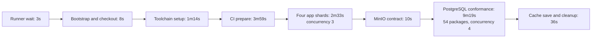

# Go application validation critical path

Profile date: 2026-09-09. This is a documentation-only profile; it does not
change workflows, Task targets, concurrency, caches, PostgreSQL settings, or
validation coverage.

## Result and evidence

The current hosted observation is the successful PR #545 merge candidate:

- [Merge validation run 34325304846](https://github.com/flidai/leapview/actions/runs/34325304846),
  event `merge_group`, SHA `4b9ee86fbd331f9f216a8ee2118e612d04422b4f`.
- [Go application tests job 102381081139](https://github.com/flidai/leapview/actions/runs/34325304846/job/102381081139),
  created at 07:43:24 UTC, started at 07:43:27, and completed successfully at
  08:01:26.
- Total job duration was **17m59s**. It ended 43 seconds after full validation
  and was the merge workflow's blocking validation job.

This candidate missed its exact Go validation cache key. Bun download caches
hit. The timings below therefore describe one cold-key hosted observation, not
a stable warm p50 or p95. Cache behavior is context for the measured compilation
and generation envelopes; changing caches is outside this profile.

## Timing breakdown

Durations are calculated from GitHub job-step timestamps and Task markers in the
job log. Nested rows are included in their parent and must not be added again.

| Phase | Start | End | Duration | Evidence and interpretation |
|---|---:|---:|---:|---|
| Runner/bootstrap wait | 07:43:24 | 07:43:27 | 3s | Job creation to runner start |
| Job bootstrap | 07:43:27 | 07:43:29 | 2s | GitHub runner setup |
| Checkout | 07:43:29 | 07:43:35 | 6s | Full-history candidate checkout |
| Cached CI toolchain setup | 07:43:35 | 07:44:49 | 1m14s | Go, Node, Bun, Task, and cache restore; the Go key missed |
| `ci:prepare` | 07:44:49 | 07:48:48 | **3m59s** | Extension fixtures, full generation graph, application build, and site build |
| ↳ Extension preparation and supply check | 07:44:49 | 07:45:30 | 41s | DuckLake, spatial, and PostgreSQL extension fixtures plus supply validation |
| ↳ Complete generation graph | 07:45:30 | 07:48:46 | **3m16s** | Sequential `generate` target |
| ↳ SQLC database generation | 07:45:34 | 07:47:01 | **1m27s** | Included in the generation graph; downloaded the pinned Go 1.26.7 toolchain and SQLC dependencies |
| ↳ Schema generation | 07:47:14 | 07:48:24 | **1m09s** | Included in the generation graph; schema export and schema documentation |
| ↳ Application and site builds | 07:48:46 | 07:48:48 | 2s | Two sequential Bun build envelopes |
| Go application validation | 07:48:48 | 08:00:50 | **12m02s** | Ordinary application shards followed by external-service validation |
| ↳ Four ordinary application shards | 07:48:48 | 07:51:21 | **2m33s** | Three processes at a time; the fourth starts when a slot becomes free |
| ↳ MinIO refresh contract | 07:51:21 | 07:51:32 | 10s | Fresh, isolated external-service test |
| ↳ PostgreSQL conformance | 07:51:32 | 08:00:50 | **9m19s** | 54 source-inventoried packages, `-p 4`, `-count=1`; all passed |
| Cache save and final cleanup | 08:00:50 | 08:01:26 | 36s | Post-action cache publication and checkout cleanup |

Setup and preparation consume **5m21s** from job start to the application-lane
command. The validation command consumes **12m02s**, of which PostgreSQL
conformance is **77%**. Cleanup adds **36s**.

### PostgreSQL and container timing

PostgreSQL setup is not a standalone workflow step. Each test owns disposable
Testcontainers resources, so startup, migration, assertions, and teardown are
interleaved throughout the 9m19s conformance envelope. The log records **478
PostgreSQL container creations and terminations**. The first test session
connected to Docker about four seconds after the conformance command began and
had its shared Reaper ready about ten seconds after the command began, but those
figures do not represent the repeated per-test startup total.

The 54 package-reported test durations sum to 2,006.219 seconds. An idealized
four-worker lower bound is 8m22s, compared with the 9m19s wall time. The largest
reported packages were:

| Package | Reported test duration |
|---|---:|
| `internal/app` | 4m49s |
| `internal/app/deploymentpostgres` | 3m09s |
| `internal/analytics/ducklake/postgres` | 2m25s |
| `internal/deployment/postgres` | 2m24s |
| `internal/access/postgres` | 2m11s |

Go buffers package output, so package log timestamps are not treated as exact
package start or completion times. The durations printed by `go test` support
the workload bound; they do not isolate compilation, container startup, and
assertion time within a package.

## Dependency and critical-path diagram

The source establishes each edge:

- The [merge workflow](../../../.github/workflows/merge-validation.yml#L68-L91)
  sequences checkout, setup, `ci:prepare`, and application validation.
- [`ci:prepare`](../../../Taskfile.yml#L1449-L1455) sequences extension
  preparation, the complete generation graph, application build, and site build.
  [`generate`](../../../Taskfile.yml#L537-L558) is itself sequential and writes
  shared workspace outputs.
- [`ci:lane:go:application`](../../../Taskfile.yml#L1413-L1417) sequences the
  ordinary shards before external-service validation.
- The [ordinary shard tasks](../../../Taskfile.yml#L1247-L1304) run with
  concurrency three and explicitly skip PostgreSQL conformance and the isolated
  MinIO contract.
- [`test:go:external`](../../../Taskfile.yml#L1306-L1317) runs MinIO before the
  PostgreSQL inventory.
- The [PostgreSQL runner](../../../scripts/postgres-conformance-tests.sh#L15-L50)
  derives a fail-closed source inventory and runs it with four package workers.

## Existing overlap and safe boundaries

Two kinds of overlap are already active and coverage-preserving:

1. The four ordinary application shards run with a three-process cap.
2. The complete PostgreSQL package inventory runs with a four-package cap. Each
   test owns fresh PostgreSQL resources and cleanup.

The strongest additional overlap candidate is the ordinary shard branch beside
the external-service branch. The selectors are deliberately disjoint: ordinary
shards set `LEAPVIEW_POSTGRES_CONFORMANCE_SKIP=1` and skip the MinIO test, while
the external branch owns those validations. This establishes coverage
separation, but hosted CPU, memory, Go compilation, and Docker contention still
need a bounded experiment before the overlap can be called operationally safe.

No further preparation overlap is proven safe. Generation, application build,
and site build mutate shared checked-out outputs, and several generators compile
packages whose generated inputs are written earlier in the same graph. MinIO and
PostgreSQL are independent services, but overlapping a ten-second MinIO test
with the container-heavy PostgreSQL phase has negligible upside and adds resource
contention. Cleanup must finish before the job can satisfy the gate.

## Top optimization candidates

These are experiment budgets, not measured improvements. Every candidate must
retain all validation commands, required generated inputs, the source-derived
inventory, freshness flags, required checks, and gate behavior.

| Priority | Candidate | Application critical-path reduction | Risk and proof needed |
|---:|---|---:|---|
| 1 | Run ordinary application shards alongside the serial MinIO → PostgreSQL branch | **Up to 2m33s**; the 12m02s validation body becomes approximately the 9m29s external branch before contention | Medium. Selection is disjoint, but measure CPU, memory, Go-cache locking, Docker stability, and all four shard plus 54-package completion |
| 2 | Define an application-specific preparation contract after mapping every generated/embed consumer; remove only site/docs/browser work proven unused by this lane | **45–90s hypothesis** from the 3m16s generation envelope | Medium/high. Missing generated assets can produce false passes or compile against stale files; require an architecture contract and generated-diff proof |
| 3 | Balance the existing PostgreSQL inventory within the same aggregate four-worker cap, prioritizing the long packages without changing freshness or coverage | **At most about 57s** from the measured 8m22s ideal lower bound versus 9m19s wall time | Medium/high. Package durations vary, Go scheduling includes compilation, and a maintained timing partition could become stale; inventory completeness must remain fail closed |

Candidate 1 is the smallest evidence-backed experiment. In this observation it
would reduce the application job toward roughly **15m26s** before resource
contention. It would also cause the unchanged 17m16s full-validation job to
become the merge blocker, so the theoretical application-lane saving would not
translate one-for-one to end-to-end merge latency.

Candidates 2 and 3 require more design evidence before implementation. This
profile does not authorize skipping generation, sharing mutable workspaces,
changing PostgreSQL concurrency, or relying on cached test results as proof.
