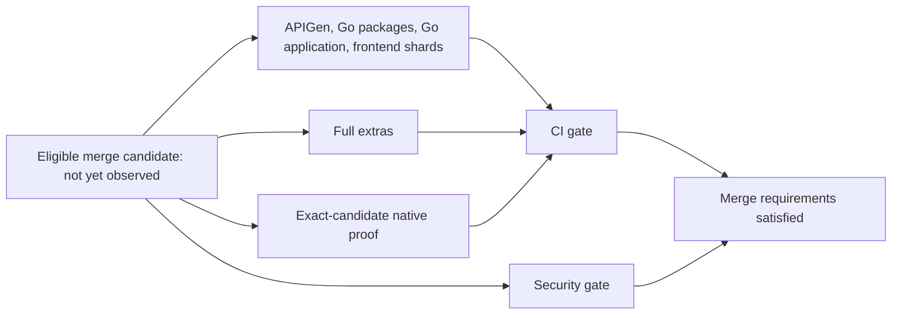

# Hosted #520 remediation measurement

## Publication and validation update — 2026-09-08

The remediation is now published in
[PR #537 — CI: remove merge validation dependency barrier](https://github.com/flidai/leapview/pull/537).

| Item | Current value |
|---|---|
| Branch | `ganesh/ci-health-520-remediation` |
| Last observed hosted PR commit | `63d4421053c75447438962511b64dec6c83e51c1` |
| PR CI exposing the boundary failure | [34204761966](https://github.com/flidai/leapview/actions/runs/34204761966), attempt 1, `pull_request` |
| Tested PR merge SHA | `b0a699243cdaabe90433bf1d22369f1a228f685b` |
| Plan | Version 2; all lanes selected for cross-cutting CI inputs; planner succeeded |
| Security / native PR proof | Security gate and Electron gate passed |
| Required CI gate | Failed after all PR lanes completed; Go package validation is the sole failed validation lane |
| Approving review | Not yet recorded; user is arranging it manually |
| Merge queue entered | No; protections and the requested approval prerequisite have not been bypassed |
| First eligible merge candidate SHA / run / date | Unavailable |
| Measured after-remediation merge duration / p95 | Unavailable |

The initial workspace was detached at `3b201d716`. A new branch was created and
fast-forwarded to current main without rewriting history. Existing work was
published in separate commits for reporting/selection (`7180ea302`), the merge
barrier removal (`74a9a6944`), and audit/measurement documentation (`77c96e318`).
GitHub MCP was disconnected, so authenticated `gh` supplied the GitHub integration.

The first [PR run 34204071795](https://github.com/flidai/leapview/actions/runs/34204071795)
exposed a reporting compatibility issue: GitHub's run metadata uses the source
head SHA, while the plan records the tested PR merge SHA. With explicit user
authorization, the separate reporting-only commit `63d442105` verifies the merge
commit's parents against the run's recorded PR head/base. It preserves exact-SHA
matching for merge-group runs, rejects stale run/attempt provenance, and leaves
unavailable evidence untrusted. Its regression tests and a read-only report over
the actual hosted artifact passed. Planner selection and workflow execution were
not changed by that fix.

### Hosted blocker and local boundary correction

[Go package job 101991986188](https://github.com/flidai/leapview/actions/runs/34204761966/job/101991986188)
failed in `TestDBTWarehouseBoundaryDoesNotEnterLeapViewRuntime` at 08:39:54 UTC.
The architecture guard classifies `DBT` and dbt lane-name literals in
`internal/platform/ci/pr_plan.go` and `health_jobs.go` as product runtime code.
Only the `ciplan` and `cireport` command packages import that CI package.

The failure reproduces locally. The authorized correction replaces the planner's
vendor-specific concepts with a neutral warehouse validation lane. Existing
workflow identifiers and version-2 artifact fields remain integration contracts;
the architecture guard remains unchanged. No failed validation is skipped or
disabled. The application lane and all other validation lanes passed; the required
CI gate correctly failed on the package lane.

Local boundary-fix validation: planner, adapter and CLI race tests passed;
the complete architecture suite passed with 84.1% coverage (82.9% floor).
Frontend contracts passed (4 tests, 25 assertions), as did quality budgets,
exception checks, all critical-package coverage floors, documentation catalog
validation and seven Mermaid diagrams. Neither runtime binary depends on the
planner or adapter. `task ci` reached required PostgreSQL conformance and failed
because this environment cannot access `/var/run/docker.sock`; that check remains
mandatory and needs hosted validation.

Next action: publish the boundary refactor, wait for the required gates and the manually arranged approving review, then use the normal merge queue
with the expected head SHA. Only after an eligible
`merge_group` run finishes can this report name the actual critical path or compare
its first observed duration with the supplied 44m40s pre-remediation p95. One
observation will not establish a new p95. No additional optimization is proposed
or implemented during this operational validation.

## Initial eligibility audit (before publication)

Checked: **2026-09-08, approximately 07:54 UTC**.
Status: **awaiting an eligible hosted run; impact cannot yet be measured**.

## Executive summary

- **Did Phase 2.3 achieve the expected improvement?** Undetermined. Its workflow
  change exists locally, but the checked hosted branch and newest candidates still
  contain the old dependency barrier.
- **Current remediated merge p95:** unavailable, with zero eligible observations.
  The supplied pre-remediation baseline is **44m40s**. No projected timing or old
  run is used as an after measurement.
- **Remaining post-remediation bottleneck:** not yet observed. The immediate
  measurement prerequisite is a hosted candidate containing the remediation.

No workflow, dependency, planner, threshold, cache, runner, gate or validation
behavior was changed in this task. The requested measurement success criteria
remain unmet until an eligible hosted execution exists.

## Measurement evidence and eligibility

Read-only GitHub Actions queries checked recent merge runs, new runs since the
previous collection cutoff, hosted `main`, and workflow contents at the exact
two newest candidate SHAs. These checks determine eligibility only. Excluded-run
timings and the old seven-day samples are not used in the comparison below.

| Evidence | Candidate SHA | UTC timestamp | Eligibility result |
|---|---|---|---|
| Hosted `main` | `e704f88068696c9fe1136a51c22b088663976f31` | Commit: 2026-09-08 06:58:54 | Full validation still depends on all base jobs |
| [Merge run 34199634415](https://github.com/flidai/leapview/actions/runs/34199634415) | `3140c97c272c018389ee8fd2e1594376463a88f3` | Created: 2026-09-08 07:30:07 | Excluded: old barrier; completed with failure |
| [Merge run 34197131849](https://github.com/flidai/leapview/actions/runs/34197131849) | `e704f88068696c9fe1136a51c22b088663976f31` | Created: 2026-09-08 06:59:14 | Excluded: old barrier; completed successfully |
| New merge runs after 2026-09-08 07:40:01 | — | Checked around 07:54 | API returned `total_count: 0` |

The [newest candidate's workflow](https://github.com/flidai/leapview/blob/3140c97c272c018389ee8fd2e1594376463a88f3/.github/workflows/merge-validation.yml)
and [hosted main revision's workflow](https://github.com/flidai/leapview/blob/e704f88068696c9fe1136a51c22b088663976f31/.github/workflows/merge-validation.yml)
both retain:

```yaml
full-validation:
  name: Full merge validation
  if: github.repository == 'flidai/leapview'
  needs: [apigen-validation, go-packages-validation, go-application-validation, frontend-validation]
```

Queries used:

```text
gh run list --repo flidai/leapview --workflow merge-validation.yml --limit 20
GET /repos/flidai/leapview/actions/workflows/merge-validation.yml/runs
    ?event=merge_group&created=%3E2026-09-08T07:40:01Z&per_page=100
GET /repos/flidai/leapview/commits/main
GET /repos/flidai/leapview/contents/.github/workflows/merge-validation.yml?ref={SHA}
```

There are **no eligible run IDs, start/end timestamps or durations to report**.
Missing observations are unavailable, not zero seconds. A local workflow edit,
successful old candidate, or rerun of an old SHA does not satisfy eligibility.

## Before/after comparison

Only the user-supplied baseline is retained. Other before values are not
reconstructed from the excluded historical population.

| Metric | Before | After |
|---|---:|---:|
| Merge p50 | Not supplied | Unavailable |
| Merge p95 | **44m40s** | **Unavailable** |
| Workflow queue time | Not supplied | Unavailable |
| Base validation elapsed | Not supplied | Unavailable |
| Full extras elapsed | Not supplied | Unavailable |
| CI gate dependency/proof wait | Not supplied | Unavailable |

Improvement, percentage reduction and attainment of the 12-minute p95 threshold
cannot be calculated. In particular, the earlier 20–22-minute estimate is not an
observed after value.

## Updated critical path

The following is the **local configuration awaiting hosted verification**, not
a measured timing diagram. The longest lane and blocking job are unknown until
that configuration executes remotely.



When collecting job timings, retain the workflow's actual inventory:

| Requested lane | Merge measurement scope |
|---|---|
| `apigen-validation` | Collect its job start, end, execution duration and runner wait |
| `go-packages-validation` | Collect its job and preparation/validation steps |
| `go-application-validation` | Collect its job and application/external-service command intervals |
| `frontend-validation` | Collect each of core, reports, chat, data and site individually |
| `full-validation` / full extras | Collect its job and preparation/validation steps; verify overlap with base lanes |
| `postgres-isolation-validation` | Separate PR job in the current architecture; not an independent merge job |
| Spatial benchmarks | Separate PR job; do not fabricate a merge-job duration |
| dbt validation | Separate PR job; collect an eligible remediated PR separately if evaluating PR impact |

Embedded database/external-service checks remain attributable to their owning
merge jobs. Separate PR timings must not enter merge percentiles.

## Recommendation

**Next engineering action: publish the existing remediation through the normal
review process and obtain a real PR/merge candidate executing it.** This measurement
task does not push, merge, enqueue or alter workflows. Confirm the tested SHA
contains the changes and that full extras actually overlaps the base jobs.

After that execution, collect:

1. Exact candidate SHA, run ID, attempt, event and workflow contents; verify the
   barrier is absent, all required jobs are present and gate/proof checks remain.
2. Run and job timestamps. Separate initial dispatch/runner delay from dependency
   waiting: runner wait is job start minus job creation; gate eligibility begins
   when all required validation jobs finish.
3. Preparation, test/qualification and cleanup step intervals; gate runner queue,
   gate execution and native-proof polling duration separately. Match security
   and native proof by the exact SHA and merge event.
4. Completed successful first-attempt elapsed samples using latest job completion
   minus run start, nearest-rank percentiles and explicit cohort/window counts.
   Report failures, cancellations, missing timestamps and reruns separately.

A first eligible run can establish overlap and a single-run improvement; it cannot
establish a stable p95. Collect a representative trailing window before assessing
the threshold. Preserve the supplied historical baseline's scope when comparing.

Full-extras decomposition, PostgreSQL conformance sharding, Go package splitting
and preparation deduplication remain **unranked in this task**. Ranking expected
latency savings before observing the remediated critical path would violate the
measurement-first requirement. No follow-up optimization is implemented.

## Validation

Documentation-only change: this report. Checked its local/remote link syntax,
Mermaid accessibility metadata, required report sections and `git diff --check`.
No code tests or hosted workflow dispatches were needed or run for this report.
Existing local remediation files remain unchanged by this task.
