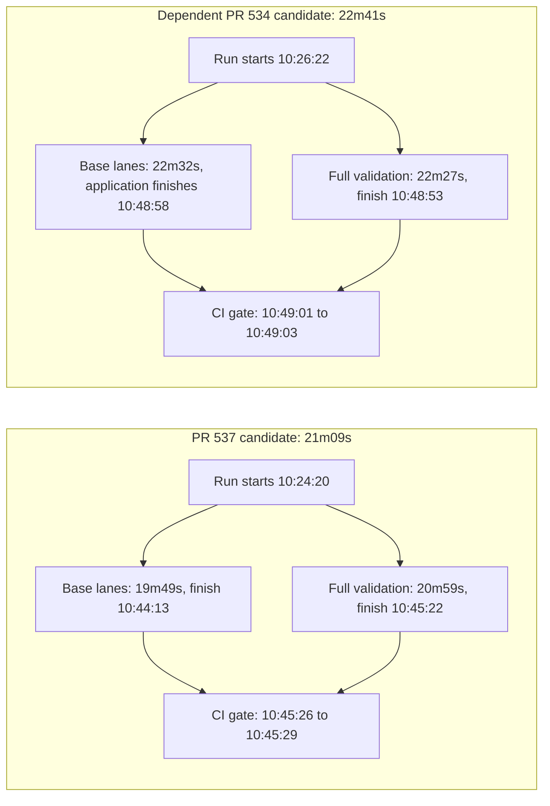

# Hosted #520 remediation measurement

## Executive summary

The merge-queue dependency barrier removal is **verified in hosted execution**.
[PR #537's candidate, run 34215268411](https://github.com/flidai/leapview/actions/runs/34215268411),
completed in **21m09s**. A dependent remediated candidate,
[run 34215448203 for PR #534](https://github.com/flidai/leapview/actions/runs/34215448203),
completed in **22m41s**. Both were successful first-attempt `merge_group` runs;
full validation started independently alongside the base lanes.

An earlier, superseded PR #537 candidate also completed in **22m02s** and is
reported separately below. These are **three individual observations**, not a new
representative p95.
The supplied historical pre-remediation p95 is **44m40s**. The observations are
substantially below that baseline, but comparing individual runs with a historical
quantile does not establish the size of a p95 improvement or isolate causality.
None of these observed runs was below the 12-minute target.

The blocking lane was **full validation** for PR #537's final candidate and **Go
application validation** for the dependent and superseded candidates. Go packages,
application, and full validation all finished within 24 seconds of one another in
the second run.
Security and native proof completed much earlier; the CI gate spent only one
second checking native proof in each primary candidate.

No workflows, code, checks, thresholds, runners, or caches were changed. No
further optimization was started.

## Corrected cohort rule and eligibility

A merge queue validates the candidate **before** completing the merge. Eligibility
therefore depends on the tested SHA and workflow, not a run starting after
`merged_at`. The previous report's timestamp cutoff incorrectly excluded the
execution that gated PR #537 itself; this report supersedes that exclusion.

A qualifying measurement must have `event=merge_group`, contain the Phase 2.3
workflow change at its tested SHA, and use `merge-validation.yml` with no base-lane
`needs` on `full-validation`. Completed successful first attempts whose required
checks passed form the primary observation set. Failures, reruns, incomplete
runs, and other events must be disclosed separately rather than blended in.

| Cohort | Evidence | Treatment |
|---|---|---|
| Pre-remediation historical baseline | User-supplied merge p95 **44m40s** | Baseline only; old seven-day runs are not after samples |
| PR #537 merge-queue validation | **34215268411**, created before PR #537 merged | Eligible: exact candidate that gated PR #537 |
| Dependent queue candidate containing #537 | **34215448203**, queue branch for PR #534 | Eligible remediated observation; not a second execution of PR #537 alone |
| Superseded earlier PR #537 candidate | **34212294501**, same Phase 2.3 workflow, different candidate SHA | Eligible supplemental observation; not the final merged candidate |
| Runs created after PR #537 merged | **34219005648**, created 11:07:13; in progress at **11:10:20 UTC** | Separate population: one pending run, no completed observation yet |

All dates below are **2026-09-08 UTC**. PR #537 merged at **10:45:55**, and PR #534
merged at **10:49:07**.

| Run | Tested SHA | Queue branch | Event / attempt / conclusion | Created = run started | Last job completed | Eligible |
|---|---|---|---|---|---|---|
| [34215268411](https://github.com/flidai/leapview/actions/runs/34215268411) | `0f50134925ac4721443751c6a313985528564416` | `gh-readonly-queue/main/pr-537-7e081e5f0806d99bf75c13bc0dee2540825f1254` | `merge_group` / 1 / success | 10:24:20 | 10:45:29 | Yes: matches PR #537's merged SHA |
| [34215448203](https://github.com/flidai/leapview/actions/runs/34215448203) | `a1c287f409620172938c03637daad646c6a29c64` | `gh-readonly-queue/main/pr-534-0f50134925ac4721443751c6a313985528564416` | `merge_group` / 1 / success | 10:26:22 | 10:49:03 | Yes: contains the merged remediation |

The [PR #537 merge](https://github.com/flidai/leapview/pull/537) identifies the first
SHA. The [commit comparison](https://github.com/flidai/leapview/compare/0f50134925ac4721443751c6a313985528564416...a1c287f409620172938c03637daad646c6a29c64)
shows the second SHA one commit ahead, zero behind, with the first SHA as merge
base. It is the merged SHA of [PR #534](https://github.com/flidai/leapview/pull/534),
which adds contract-projection work; these are not repeated trials of identical
source content.

The [workflow at the first SHA](https://github.com/flidai/leapview/blob/0f50134925ac4721443751c6a313985528564416/.github/workflows/merge-validation.yml)
and [workflow at the second SHA](https://github.com/flidai/leapview/blob/a1c287f409620172938c03637daad646c6a29c64/.github/workflows/merge-validation.yml)
are byte-identical to the remediated workflow, SHA-256
`d07183311b59571ca16ce4d0f5b8cb72e70b4d38aa0793245ad5a0e84345ea6e`.
`full-validation` has no `needs`; CI gate retains all base/full dependencies and
exact-SHA native proof. The squash-merged SHA is authoritative; requiring the
original branch head to be its ancestor would incorrectly reject this candidate.

The post-merge-created [run 34219005648](https://github.com/flidai/leapview/actions/runs/34219005648)
is a `merge_group`, attempt 1, for PR #538, tested SHA
`a97e07e35abb11a9f97052c28a3d8a1855c850bb`. It starts from the PR #534 candidate,
is two commits ahead of the merged remediation, and has the identical workflow
hash above. Its CI gate and required results are not complete at the cutoff:
**no final duration or latency sample is assigned to this pending run**.

The window from PR #537's creation (08:21:34) through 11:10:20 contains six
merge-validation runs: the three completed remediated observations, that pending
post-merge run, and two older-workflow runs, 34204567000 and 34212032765. The latter
two still contain the full-validation dependency barrier and remain excluded.

## Before/after measurements

Workflow elapsed is **latest job completion minus run start**, matching the
reporter's completion-based measure. GitHub's mutable run `updated_at` values
are 10:45:30 and 10:49:04: their respective start-to-update spans are 21m10s and
22m42s, one second longer than the execution measure. They are not substituted
for actual job completion times.

| Metric | Historical before | PR #537 candidate | Dependent PR #534 candidate |
|---|---:|---:|---:|
| Merge duration | **44m40s p95** | **21m09s**, one observation | **22m41s**, one observation |
| Workflow queue: created to run started | Not supplied | 0s | 0s |
| Initial dispatch: run started to first job started | Not supplied | 3s | 4s |
| Base validation wall span | Not supplied | 19m49s | 22m32s |
| Full-validation job duration | Not supplied | 20m59s | 22m27s |
| CI gate dependency wait from run start | Not supplied | 21m02s | 22m36s |
| Dependency release: last validation end to gate created | Not supplied | 1s | 0s |
| CI gate scheduling wait: created to started | Not supplied | 3s | 3s |
| CI gate execution | Not supplied | 3s | 2s |
| Native-proof check step inside CI gate | Not supplied | 1s | 1s |
| Current representative merge p95 | 44m40s baseline | Not established | Not established |

Base span is earliest base-job start to latest base-job completion; it is not the
sum of parallel jobs. Gate dependency wait is expected waiting for required
validation, not a runner queue. Job creation-to-start is an observable scheduling
interval that may include provisioning; pure runner-capacity wait is not exposed.
The one-second native check includes its API request and is not evidence of a
one-second sleep/poll delay.

## Job timing evidence

Each table comes from the attempt-1 jobs endpoint, **10 of 10 jobs** returned and
all concluded `success`. Job links provide the original hosted evidence.

### PR #537 candidate: 34215268411

| Job | Created / queued | Started | Completed | Duration | Scheduling wait |
|---|---|---|---|---:|---:|
| [apigen-validation](https://github.com/flidai/leapview/actions/runs/34215268411/job/102025424436) | 10:24:20 | 10:24:24 | 10:29:17 | 4m53s | 4s |
| [frontend-validation/chat](https://github.com/flidai/leapview/actions/runs/34215268411/job/102025424769) | 10:24:20 | 10:24:24 | 10:30:52 | 6m28s | 4s |
| [frontend-validation/core](https://github.com/flidai/leapview/actions/runs/34215268411/job/102025424699) | 10:24:20 | 10:24:24 | 10:31:17 | 6m53s | 4s |
| [frontend-validation/data](https://github.com/flidai/leapview/actions/runs/34215268411/job/102025424889) | 10:24:20 | 10:24:24 | 10:31:06 | 6m42s | 4s |
| [frontend-validation/reports](https://github.com/flidai/leapview/actions/runs/34215268411/job/102025424783) | 10:24:20 | 10:24:24 | 10:31:42 | 7m18s | 4s |
| [frontend-validation/site](https://github.com/flidai/leapview/actions/runs/34215268411/job/102025424843) | 10:24:20 | 10:24:24 | 10:31:48 | 7m24s | 4s |
| [full-validation](https://github.com/flidai/leapview/actions/runs/34215268411/job/102025424673) | 10:24:20 | 10:24:23 | 10:45:22 | 20m59s | 3s |
| [go-application-validation](https://github.com/flidai/leapview/actions/runs/34215268411/job/102025424924) | 10:24:20 | 10:24:24 | 10:44:13 | 19m49s | 4s |
| [go-packages-validation](https://github.com/flidai/leapview/actions/runs/34215268411/job/102025424741) | 10:24:20 | 10:24:24 | 10:40:46 | 16m22s | 4s |
| [CI gate](https://github.com/flidai/leapview/actions/runs/34215268411/job/102031377233) | 10:45:23 | 10:45:26 | 10:45:29 | 0m03s | 3s |

### Dependent candidate: 34215448203

| Job | Created / queued | Started | Completed | Duration | Scheduling wait |
|---|---|---|---|---:|---:|
| [apigen-validation](https://github.com/flidai/leapview/actions/runs/34215448203/job/102026006539) | 10:26:23 | 10:26:26 | 10:31:13 | 4m47s | 3s |
| [frontend-validation/chat](https://github.com/flidai/leapview/actions/runs/34215448203/job/102026006456) | 10:26:23 | 10:26:27 | 10:33:51 | 7m24s | 4s |
| [frontend-validation/core](https://github.com/flidai/leapview/actions/runs/34215448203/job/102026006414) | 10:26:23 | 10:26:26 | 10:32:42 | 6m16s | 3s |
| [frontend-validation/data](https://github.com/flidai/leapview/actions/runs/34215448203/job/102026006477) | 10:26:23 | 10:26:27 | 10:34:28 | 8m01s | 4s |
| [frontend-validation/reports](https://github.com/flidai/leapview/actions/runs/34215448203/job/102026006550) | 10:26:23 | 10:26:26 | 10:34:04 | 7m38s | 3s |
| [frontend-validation/site](https://github.com/flidai/leapview/actions/runs/34215448203/job/102026006493) | 10:26:23 | 10:26:27 | 10:34:27 | 8m00s | 4s |
| [full-validation](https://github.com/flidai/leapview/actions/runs/34215448203/job/102026006445) | 10:26:23 | 10:26:26 | 10:48:53 | 22m27s | 3s |
| [go-application-validation](https://github.com/flidai/leapview/actions/runs/34215448203/job/102026006476) | 10:26:23 | 10:26:27 | 10:48:58 | 22m31s | 4s |
| [go-packages-validation](https://github.com/flidai/leapview/actions/runs/34215448203/job/102026006260) | 10:26:23 | 10:26:27 | 10:48:34 | 22m07s | 4s |
| [CI gate](https://github.com/flidai/leapview/actions/runs/34215448203/job/102032377857) | 10:48:58 | 10:49:01 | 10:49:03 | 0m02s | 3s |

### Supplemental: superseded PR #537 candidate 34212294501

The corrected rule also admits this earlier successful first-attempt `merge_group`
run, SHA `13e061045193ac0fc794ee4112e9ab0939f66fbb`, created/started **09:51:18**,
last job completed **10:13:20**. Its queue branch identifies PR #537, and its
[exact workflow](https://github.com/flidai/leapview/blob/13e061045193ac0fc794ee4112e9ab0939f66fbb/.github/workflows/merge-validation.yml)
has the same SHA-256 above. Lack of descent from the later merged SHA is not a
valid reason to exclude this earlier remediated candidate.

Its workflow elapsed was **22m02s**, with zero initial workflow queue, **21m53s**
base span, and **21m38s** full validation. CI gate dependency wait from run start
was **21m56s**, then 0s release delay, 3s scheduling, and 3s execution. The native
proof check step took 0s at API timestamp resolution. Go application was the
blocker, finishing 14s after full validation. Full validation started at 09:51:22
while base jobs were already active and overlapped them for its entire 21m38s.

| Job | Created / queued | Started | Completed | Duration | Scheduling wait |
|---|---|---|---|---:|---:|
| [apigen-validation](https://github.com/flidai/leapview/actions/runs/34212294501/job/102015867712) | 09:51:18 | 09:51:21 | 09:55:43 | 4m22s | 3s |
| [frontend-validation/chat](https://github.com/flidai/leapview/actions/runs/34212294501/job/102015867982) | 09:51:18 | 09:51:27 | 09:58:17 | 6m50s | 9s |
| [frontend-validation/core](https://github.com/flidai/leapview/actions/runs/34212294501/job/102015867993) | 09:51:18 | 09:51:21 | 09:57:51 | 6m30s | 3s |
| [frontend-validation/data](https://github.com/flidai/leapview/actions/runs/34212294501/job/102015868095) | 09:51:18 | 09:51:22 | 09:58:35 | 7m13s | 4s |
| [frontend-validation/reports](https://github.com/flidai/leapview/actions/runs/34212294501/job/102015868122) | 09:51:18 | 09:51:21 | 09:58:28 | 7m07s | 3s |
| [frontend-validation/site](https://github.com/flidai/leapview/actions/runs/34212294501/job/102015868161) | 09:51:18 | 09:51:22 | 09:57:33 | 6m11s | 4s |
| [full-validation](https://github.com/flidai/leapview/actions/runs/34212294501/job/102015867963) | 09:51:18 | 09:51:22 | 10:13:00 | 21m38s | 4s |
| [go-application-validation](https://github.com/flidai/leapview/actions/runs/34212294501/job/102015868150) | 09:51:18 | 09:51:22 | 10:13:14 | 21m52s | 4s |
| [go-packages-validation](https://github.com/flidai/leapview/actions/runs/34212294501/job/102015868094) | 09:51:18 | 09:51:22 | 10:07:14 | 15m52s | 4s |
| [CI gate](https://github.com/flidai/leapview/actions/runs/34212294501/job/102022211196) | 10:13:14 | 10:13:17 | 10:13:20 | 0m03s | 3s |

Its exact-SHA, `merge_group` [Security run 34212294502](https://github.com/flidai/leapview/actions/runs/34212294502)
completed successfully from 09:51:18 to 09:55:49 (**4m31s**), with Security gate
09:55:26–09:55:49 (23s). The [Electron proof run 34212294553](https://github.com/flidai/leapview/actions/runs/34212294553)
completed successfully from 09:51:18 to 09:54:57 (**3m39s**), with Electron gate
09:54:53–09:54:57 (4s). Together with the successful CI gate, the required checks
were complete. These proofs did not extend the merge critical path.

## Required checks, security, and native proof

The active main ruleset requires **CI gate** and **Security gate**. CI gate also
requires the exact-candidate successful `electron-security-proof.yml` merge-group
workflow. All these checks completed successfully for the two primary candidates; the
supplemental candidate's successful gates are recorded above.

| Candidate | Workflow run | Started | Last job completed | Elapsed | Gate created / started / completed | Gate result |
|---|---|---|---|---:|---|---|
| 34215268411 | [Security gate: 34215268258](https://github.com/flidai/leapview/actions/runs/34215268258) | 10:24:19 | 10:29:30 | 5m11s | 10:29:07 / 10:29:10 / 10:29:30 | success |
| 34215268411 | [Electron gate: 34215268510](https://github.com/flidai/leapview/actions/runs/34215268510) | 10:24:20 | 10:29:23 | 5m03s | 10:29:18 / 10:29:21 / 10:29:23 | success |
| 34215448203 | [Security gate: 34215448324](https://github.com/flidai/leapview/actions/runs/34215448324) | 10:26:22 | 10:31:33 | 5m11s | 10:31:10 / 10:31:13 / 10:31:33 | success |
| 34215448203 | [Electron gate: 34215448215](https://github.com/flidai/leapview/actions/runs/34215448215) | 10:26:22 | 10:30:20 | 3m58s | 10:30:14 / 10:30:17 / 10:30:20 | success |

Both security gates queued for 3s and executed for 20s. The Electron gates queued
for 3s and executed for 2s / 3s. Security and native proof were complete more than
15 minutes before the respective CI gates started. They did not extend the
measured merge critical paths.

Match proof evidence by **SHA and event**, not the newest check with that name.
The same first SHA subsequently received `push` runs 34217166813 (security) and
34217166812 (Electron), both cancelled after merge. Their non-success aggregate checks
do not replace the successful `merge_group` proof above or invalidate its timing.
Post-merge `push` runs are not merge-validation observations.

The native workflows intentionally skipped their push-only main-attestation job;
their merge-proof jobs and Electron gates succeeded. Some native jobs' raw step
times precede their reported job starts, and skipped attestation has reversed
start/end times. Neither anomaly is used to derive a native command duration:
the support-workflow spans above use run start and the last completed job.

## Concurrency proof and measured critical path

For PR #537, full validation started at **10:24:23**, one second before the base
lanes started at 10:24:24 and **19m50s before** the last base lane finished at
10:44:13. It overlapped the entire **19m49s** base span and finished at 10:45:22.

For the dependent candidate, full validation started at **10:26:26**, alongside
the earliest base lanes and **22m32s before** base completion at 10:48:58. It
finished at 10:48:53, after **22m27s** of overlap. This is timestamp evidence of
independent execution, not a projection from YAML alone.



The first blocker was full validation, finishing **1m09s** after the application
lane. In the second candidate, application finished **5s** after full validation
and **24s** after Go packages. Optimizing just one of these lanes would not
necessarily materially reduce the next candidate's end-to-end duration.

### Expensive lane step breakdown

These are measured step intervals, not CPU time or pure test-runtime estimates.
The main validation commands include their existing internal subcommands.

| Candidate / lane | Checkout | Toolchain setup | Generated preparation | Main validation command | Post-job toolchain + checkout cleanup |
|---|---:|---:|---:|---:|---:|
| 34215268411 / Go package | 0m07s | 2m00s | 4m02s | 9m32s | 0m02s |
| 34215268411 / Go application | 0m07s | 1m45s | 3m26s | 14m26s | 0m01s |
| 34215268411 / Full validation | 0m06s | 2m02s | 4m00s | 14m46s | 0m02s |
| 34215448203 / Go package | 0m07s | 1m55s | 3m24s | 15m49s | 0m21s |
| 34215448203 / Go application | 0m07s | 2m03s | 4m10s | 15m44s | 0m23s |
| 34215448203 / Full validation | 0m06s | 2m17s | 4m07s | 15m04s | 0m50s |

The table omits job bookkeeping gaps and separate Prometheus/generated-artifact
checks, so its columns are not expected to sum exactly to job duration. Full
validation's main command alone took 14m46s / 15m04s; application validation took
14m26s / 15m44s. Package validation varied from 9m32s to 15m49s across different
candidate content. Setup and preparation are also material (roughly 5–6 minutes
before the principal commands), while runner dispatch and gate waits are small.

## Interpretation and next measurement

Barrier removal worked and the first remediated merge observations are about
21–23 minutes, substantially below the supplied 44m40s historical p95. A new p95
or an isolated causal effect is **not established by this small candidate cohort**.
Collect a representative set of successful merge-group attempts, retain failures
and reruns separately, and keep the final PR #537, superseded candidate, dependent
candidate, and post-merge-created cohort labels when extending the report.

The remaining observed work lies in full validation and application/package
validation, including preparation. Security/native proof and runner queues were
not the bottleneck in these observations. Further measurement should attribute
those long command intervals before selecting any optimization. No decomposition,
sharding, caching, runner tuning, or workflow change was performed here.

## Sources, method, and validation

GitHub MCP was disconnected (`USER_NOT_LOGGED_IN`), so authenticated read-only
`gh api` requests provided the data. Evidence was collected on 2026-09-08 and
reconciled against the current completed runs and active main ruleset.

```text
GET /repos/flidai/leapview/pulls/537
GET /repos/flidai/leapview/pulls/534
GET /repos/flidai/leapview/actions/runs/{run_id}
GET /repos/flidai/leapview/actions/runs/{run_id}/attempts/1/jobs?per_page=100&page=1
GET /repos/flidai/leapview/actions/runs?head_sha={sha}&event=merge_group&per_page=100
GET /repos/flidai/leapview/contents/.github/workflows/merge-validation.yml?ref={sha}
GET /repos/flidai/leapview/compare/{merged_remediation_sha}...{candidate_sha}
GET /repos/flidai/leapview/rules/branches/main
GET /repos/flidai/leapview/actions/workflows/merge-validation.yml/runs
    ?event=merge_group&created=%3E2026-09-08T10%3A45%3A55Z&per_page=100
```

All collected job totals fit one page and were checked against `total_count`;
each associated security/proof workflow is attempt 1, event `merge_group`, and
matches the exact candidate SHA. Raw responses are retained in the local
`/home/codex/.cache/ci-hosted-measurement-20260908` evidence directory. All run/job
identifiers and timestamps needed to reproduce the tables are included above.

Only this report changed. Documentation catalog checks, validation of all seven
Mermaid diagrams, and `git diff --check` passed. No code tests, workflow changes,
or hosted dispatches were performed for this measurement-only task.
