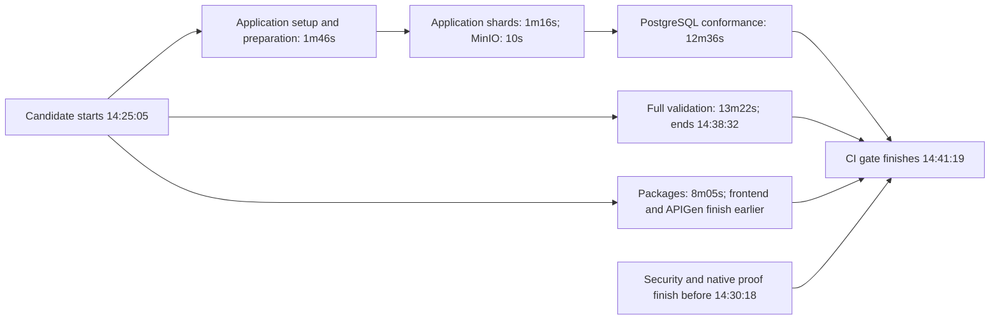
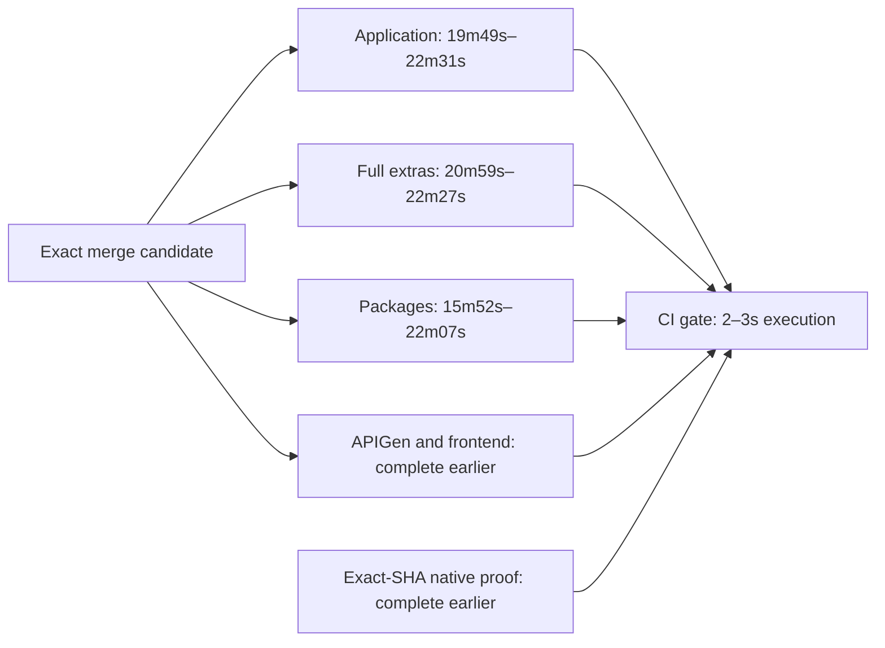

# Remaining merge CI critical path — #520

## Current optimization record — post-#540, 2026-09-08

**Target not achieved — further work deferred.**
The latest eligible merge-group candidate observation is **13m19s**. Across one
pre-#544 warm baseline and two successful post-#544 candidates, a representative
post-#540 merge p95 is **not established**. No projected result is treated as a
measured quantile.

### Baseline and eligibility

| Population | Hosted evidence | Interpretation |
|---|---|---|
| Pre-#520 | 44m40s p95, supplied historical baseline | Historical quantile; not recalculated here |
| Post-barrier, pre-#540 | 21m09s, 22m02s, 22m41s | Three successful candidate observations, not p95 |
| Post-#540 cache code, superseded candidate | [34231318413](https://github.com/flidai/leapview/actions/runs/34231318413), 23m51s, failure | Cold-cache candidate; frontend failed; excluded from successful population and retained as diagnostic evidence |
| Post-#540 final candidate | [34238120694](https://github.com/flidai/leapview/actions/runs/34238120694), **16m14s**, success | Warm same-queue-ref observation; not a general fresh-queue baseline |

Both new runs are `merge_group`, attempt 1. The successful tested SHA is
`603773f3e3bbec6faf29d20272ccf36ace09d714`, the squash merge of
[PR #540](https://github.com/flidai/leapview/pull/540). The earlier SHA is
`7e42e298cf0042a00b9b02026787bdf788fe2307`; it contains the cache ownership change
but predates the final frontend test refactor. Both retain independent full/base
validation and unchanged required gates. A candidate is eligible before its final
merge timestamp: #540 merged at 14:41:44, after its validation completed.

The successful run was created/started at **14:25:05**, first required validation
started **14:25:10**, last validation completed **14:41:11**, and CI gate was
created **14:41:12**, started **14:41:15**, completed **14:41:19**. Thus workflow
queue is 0s, initial dispatch 5s, gate dependency wait from run start 16m07s,
gate scheduling 3s, and gate execution 4s. Native proof checking took 1s.
The failed candidate started 13:20:06 and ended 13:43:57. These durations use
last job completion, not mutable workflow `updated_at`.

The exact-SHA merge-group [Security run 34238120701](https://github.com/flidai/leapview/actions/runs/34238120701)
completed 14:25:05–14:30:18; its gate ran 14:29:47–14:30:18.
[Native proof run 34238120401](https://github.com/flidai/leapview/actions/runs/34238120401)
completed 14:25:05–14:29:04; Electron gate ran 14:29:01–14:29:04. Both passed,
well before CI gate. Push-event proofs are not substituted for these merge proofs.

All job timestamps below are UTC on 2026-09-08. Scheduling means job creation
to start, not pure runner-capacity wait. Setup/preparation are explicit steps;
execution is the main `Run ...` step and includes nested preparation. Other steps
and cleanup make up the remaining job duration; parallel rows must not be summed
to infer workflow latency.

| Lane | Created | Started | Completed | Scheduling | Job duration | Setup | Preparation | Main validation |
|---|---|---|---|---:|---:|---:|---:|---:|
| [Go application tests (merge queue)](https://github.com/flidai/leapview/actions/runs/34238120694/job/102101021267) | 14:25:06 | 14:25:10 | 14:41:11 | 0m04s | 16m01s | 0m58s | 0m48s | 14m02s |
| [APIGen tests (merge queue)](https://github.com/flidai/leapview/actions/runs/34238120694/job/102101021472) | 14:25:06 | 14:25:11 | 14:27:49 | 0m05s | 2m38s | 0m35s | 0m00s | 1m53s |
| [Go package tests (merge queue)](https://github.com/flidai/leapview/actions/runs/34238120694/job/102101021513) | 14:25:06 | 14:25:46 | 14:33:51 | 0m40s | 8m05s | 1m05s | 0m49s | 5m12s |
| [Frontend tests (merge queue, core)](https://github.com/flidai/leapview/actions/runs/34238120694/job/102101021548) | 14:25:06 | 14:25:10 | 14:28:10 | 0m04s | 3m00s | 1m17s | 0m49s | 0m33s |
| [Frontend tests (merge queue, reports)](https://github.com/flidai/leapview/actions/runs/34238120694/job/102101021585) | 14:25:06 | 14:25:10 | 14:28:13 | 0m04s | 3m03s | 1m19s | 0m45s | 0m41s |
| [Full merge validation](https://github.com/flidai/leapview/actions/runs/34238120694/job/102101021631) | 14:25:06 | 14:25:10 | 14:38:32 | 0m04s | 13m22s | 1m12s | 0m48s | 11m09s |
| [Frontend tests (merge queue, data)](https://github.com/flidai/leapview/actions/runs/34238120694/job/102101021644) | 14:25:06 | 14:25:10 | 14:27:47 | 0m04s | 2m37s | 1m01s | 0m48s | 0m29s |
| [Frontend tests (merge queue, chat)](https://github.com/flidai/leapview/actions/runs/34238120694/job/102101021675) | 14:25:06 | 14:25:10 | 14:27:21 | 0m04s | 2m11s | 1m11s | 0m37s | 0m08s |
| [Frontend tests (merge queue, site)](https://github.com/flidai/leapview/actions/runs/34238120694/job/102101021790) | 14:25:06 | 14:25:10 | 14:28:07 | 0m04s | 2m57s | 1m23s | 0m42s | 0m35s |
| [CI gate](https://github.com/flidai/leapview/actions/runs/34238120694/job/102106924599) | 14:41:12 | 14:41:15 | 14:41:19 | 0m03s | 0m04s | 0m00s | 0m00s | 0m00s |

### Cache impact and provenance

Application, package, and full lanes restored their exact `go-validation-v1`
workload keys, with Go 1.26.8, Linux/X64/ubuntu24 and dependency/tool hash
`f73d267d86aa8a45df227ac8bcc6d469b51a07146ff733d45f6ff309196793aa`.
Their keys begin respectively with `go-validation-v1-go-application-validation-`,
`go-validation-v1-go-packages-validation-`, and `go-validation-v1-full-validation-`.
The identity and trust contract is documented in [go-cache-ownership.md](go-cache-ownership.md).

| Cache | Archive bytes | Producer run / save time | Hit-to-restored interval in successful candidate | Save outcome |
|---|---:|---|---:|---|
| Application | 1,797,336,371 | 34231318413 / 13:41:59 | 32.97s | Exact hit; no replacement save |
| Packages | 1,909,576,798 | 34231318413 / 13:36:46 | 37.26s | Exact hit; no replacement save |
| Full | 2,644,093,773 | 34231318413 / 13:43:47 | 34.68s | Exact hit; no replacement save |

All three producers belong to
`refs/heads/gh-readonly-queue/main/pr-540-a97e07e35abb11a9f97052c28a3d8a1855c850bb`.
The second candidate reused that ref. At collection time there were **no main-ref
application/package/full entries** for these keys. This proves ownership and warm
reuse, but not availability to a new queue ref. The successful jobs of the failed
candidate legitimately populated caches; those caches are not validation proof.

The existing [nightly workflow dispatch 34241712716](https://github.com/flidai/leapview/actions/runs/34241712716)
on merged main SHA `603773f3...` was requested to establish trusted main-ref
producers before the experiment. This is an operational baseline prerequisite,
not another workflow optimization and not a merge-latency sample. Its outcome and
cache provenance must be checked before labelling a new candidate warm. Its
nightly dependency-security job failed the Node audit (including fast-uri
advisories); successful cache-producing jobs do not make that workflow green.
This experiment does not change dependency security.

| Question | Evidence-based answer |
|---|---|
| Did raw cache restore become faster? | Not established; richer Go archives now cost about 33–37s to restore. |
| Did overall setup/preparation shrink? | Yes in the warm observation: application 1m46s versus 5m11s–6m13s; full 2m00s versus 6m02s–6m24s; packages 1m54s versus 5m19s–6m02s. This is not a controlled cache-only attribution; Buf removal is included. |
| Did validation become faster? | Application 14m02s versus 14m26s–15m44s; full 11m09s versus 14m46s–15m12s; package main step 5m12s versus 9m32s/15m49s in the primary earlier samples. Source/runner/cache variation remains. |
| Did merge critical path shrink? | The warm observation is 16m14s versus earlier 21–23m observations; no representative p95 or guaranteed 1–3m cache-only saving is established. |

### Current critical path and command profile

Within the application preparation, SQL generation took about 17.0s and schema
generation about 0.6s. The conformance log contains 475 PostgreSQL container
creation events; disposable instances remain an intentional isolation cost.

Application command markers place its four ordinary shards at
14:27:03.812–14:28:19.762 (**75.95s**), isolated MinIO at
14:28:19.762–14:28:29.897 (**10.13s**), and source-inventoried PostgreSQL
conformance at 14:28:29.897–14:41:05.719 (**755.82s**).
PostgreSQL is the tail of the actual blocking lane, not just work inside a long
nonblocking job. The observed baseline ran 54 packages with two concurrent Go
package slots. The
reported package test durations sum to 1,403.917 seconds, with the largest package
171.735s, supporting an experiment with more bounded package concurrency.
Package log output can be buffered; report-line timestamps are not exact package
start/completion timestamps and are not used as such.

Full extras remain sequential: critical race qualification about 2m57s,
UI/framework QA about 4m19s, deployment checks about 35s, MinIO about 7s, and
lifecycle/GC about 2m20s. Workload qualification is about 17s and multi-node
PostgreSQL about 19s. Vet/package race are now small warm steps. UI QA owns a
managed server and generated paths; splitting it safely would require isolated
execution. This experiment does not parallelize full extras or share workspaces.

Preparation artifacts remain an unproven alternative: generated inputs could be
immutable at an exact SHA, but SQL determinism/generated-output checks must still
run locally, extension provisioning has platform/private-path requirements, and
all databases, test credentials, evidence and mutable workspace state must stay
isolated. Current warm preparation is under one minute per long lane, so saving
aggregate runner-minutes is not a justification for a new preparation barrier.

### Ranked experiments

| Candidate | Current cost | Critical-path impact | Expected saving | Risk | Recommendation |
|---|---:|---:|---:|---|---|
| Raise PostgreSQL package cap 2 to 4 | 12m36s | Direct tail of blocking application lane | Hypothesis: reduce PostgreSQL substantially; merge benefit capped near 2m39s by full extras | Medium: CPU, memory and Docker contention may erase gains | Run this one bounded experiment |
| Overlap ordinary app shards and external validation | 1m26s before PostgreSQL | At most 1m26s before contention/overlap overhead | Smaller than the first candidate | Medium: shared runner concurrency and container load | Defer |
| Split full extras | 13m22s entire job | Zero benefit by itself in this observation | Runner work may overlap, but application remains blocker | Medium/high: isolated runners or shared-state audit needed | Defer until application improvement is measured |
| Centralize generated preparation | 37–49s explicit warm prep | Less than one minute before added barrier/transfer costs | Mostly aggregate runner-minute savings; elapsed gain unproven | High relative to measured opportunity | Do not implement |
| Additional cache redesign | 33–37s Go restores | Warm setup now small; publication prerequisite already uses existing nightly | No defensible extra saving yet | Storage/ref-scope and toolchain trust | Observe existing ownership fix only |

### Experiment 1 — bounded PostgreSQL package concurrency

**Hypothesis:** allowing four source-inventoried packages to run concurrently on
the existing runner reduces the 12m36s PostgreSQL tail while preserving the whole
inventory. The overall improvement is bounded by unchanged full extras: even an
instant application lane would leave approximately 13m30s including gate delay.
This experiment alone cannot be claimed to meet the 12-minute target.

**Implementation:** change only `scripts/postgres-conformance-tests.sh` package
parallelism from `-p 2` to `-p 4`, with executable regression coverage. No runner,
workflow, Task target, required name, planner selection, gate dependency or cache
key changes. `-count=1`, integration/DuckDB tags, mandatory PostgreSQL flag,
MinIO ownership and package-wide source inventory remain intact. Each package
still uses the disposable PostgreSQL harness; no database/workspace is shared.

**Failure and safety:** reduced free memory or Docker contention can worsen
latency or fail tests; no retry or timeout increase will mask it. Empty inventories
and failed Go commands must remain failures. This experiment does not publish
artifacts or introduce a new cache. Existing caches remain optional input reuse,
not evidence that tests executed.

**Decision criteria:** compare exact-SHA successful hosted merge candidates with
matching warm-cache provenance, record cold/miss runs separately, confirm every
required lane/security/native proof, and measure PostgreSQL and total elapsed.
One after run is an observation, not a new representative p95.

**Local validation:** planner/gate/reporting and complete architecture tests passed;
frontend workflow contracts, quality budget/exception checks, and workflow lint
passed. The new runner contract failed against the old two-worker setting and
passed with four, including empty-inventory and Go-error failure cases. The live
source inventory is byte-identical at 54 packages after adding the contract test.
`task ci` ran generation and SQL verification, then stopped at PostgreSQL baseline
validation because this workspace cannot access Docker. This is an environment
blocker; real PostgreSQL execution and resource contention require hosted CI.

### Hosted outcome after PR #544

Two successful `merge_group` runs contain the four-worker change. Run
[34245738076](https://github.com/flidai/leapview/actions/runs/34245738076) tested
PR #544's merge SHA `d1bc8043939311f53f6b01708a7833992daa227e`, attempt 1.
Run [34276117337](https://github.com/flidai/leapview/actions/runs/34276117337)
tested `4f677d4b9e18c65085299734556eeeca390f5305`, attempt 1; GitHub's commit
comparison reports that SHA is one commit ahead of the PR #544 merge SHA. Both
workflows and every merge-validation job, including CI gate, completed
successfully.

Merge duration below is workflow start through CI gate completion. PostgreSQL
duration is the hosted command interval from the conformance task marker through
its final package result. All timestamps are UTC on 2026-09-08.

| Metric | Pre-#544 warm observation | Run 34245738076 | Run 34276117337 |
|---|---:|---:|---:|
| Workflow start / gate completion | 14:25:05 / 14:41:19 | 15:35:32 / 15:54:25 | 20:39:47 / 20:53:06 |
| Merge duration | **16m14s** | **18m53s** | **13m19s** |
| Go packages job | 8m05s | 7m33s | 10m10s |
| Go application job | 16m01s | 12m15s | 11m43s |
| PostgreSQL conformance | 12m36s | **8m50s** | **8m03s** |
| Full validation job | 13m22s | 18m43s | 13m07s |
| Critical-path validation | Go application | Full validation | Full validation |

The exact tested version of `scripts/postgres-conformance-tests.sh` contains
`go test ... -p 4 -count=1` at both SHAs. Each application log has 54 unique,
successful package result lines after the PostgreSQL conformance marker, matching
the complete source inventory. Coverage, freshness and failure behavior therefore
remained active in these observations.

The targeted lane improved materially: PostgreSQL fell by 3m46s and 4m33s, and
Go application fell by 3m46s and 4m18s. End-to-end merge improvement is not yet
consistent. The first candidate was 2m39s slower because full validation expanded
to 18m43s; the next was 2m55s faster, at 13m19s. Across only these two after runs,
there is no representative p95 and no defensible claim of a material typical
merge-latency reduction. Full validation replaced Go application as the blocking
lane in both runs.

**Decision:** retain the bounded concurrency result as successful for its targeted
lane, but stop this experiment without claiming the merge p95 improved. The best
observed merge remains 1m19s above the threshold, so the **<12m target was not
reached**.

### Experiment 2 — bounded full-validation overlap

**Before:** run 34276117337 completed full validation in **13m07s**, including a
9m44s merge-extras body. Its slowest sequential groups were UI QA at 3m30s,
plan/GC conformance at 2m15s, and critical race qualification at 2m10s.

**Implementation:** the merge workflow uses `ci:full:extras:hosted`. Desktop and
UI QA remain serial because they build or regenerate workspace inputs and UI QA
owns fixed `.tmp` server state. A serial `generate` barrier follows UI QA. The
remaining work then has two concurrent Task dependency branches: a static branch
with vet, package race, critical race and workload validation; and a runtime
branch with PostgreSQL multinode, deployment, MinIO and plan/GC validation. The
runtime branch remains serial so container-backed checks do not compete with one
another. The ordinary `ci:full:extras` target retains its original sequential
order for local and nightly execution.

Every existing validation command remains present. The workflow job name, CI gate
dependency, required checks, candidate checkout, native proof and failure-artifact
behavior are unchanged. Hosted evidence and the retain/revert decision are
pending.

## Historical pre-#540 profile

Profiled 2026-09-08, before the tool-installation follow-up. The deployed Phase 2.3
cohort and exact-SHA eligibility checks are in
[hosted-remediation-measurement.md](hosted-remediation-measurement.md). The older
[critical-path report](ci-critical-path-measurement.md) is the historical baseline,
not the current deployed population.

## Measured critical path

| Merge candidate | Elapsed | Blocking lane | Gap to next lane |
|---|---:|---|---:|
| [34212294501](https://github.com/flidai/leapview/actions/runs/34212294501), superseded PR #537 | 22m02s | Go application | 14s after full extras |
| [34215268411](https://github.com/flidai/leapview/actions/runs/34215268411), final PR #537 | 21m09s | Full extras | 1m09s after application |
| [34215448203](https://github.com/flidai/leapview/actions/runs/34215448203), dependent PR #534 | 22m41s | Go application | 5s after full extras; 24s after packages |

These are three observations on different candidates, not a new p95. The historical
pre-remediation p95 remains **44m40s**. Queue delays are small and the CI gate
executes in 2–3 seconds in this cohort. Security and native proof complete well
before validation, as documented in the linked evidence report.

## Hosted step profile

Durations below use GitHub's attempt-1 job/step timestamps. Queue is
`started_at - created_at`; total excludes that queue. Validation includes SQL
verification, compilation, test processes and package-lane generated/Prometheus
checks. It is not pure test CPU time. Other retains runner transitions and API
rounding; cleanup includes post actions. No timing is inferred from local runs.

| Run | Lane | Queue | Checkout | Setup | Preparation | Validation | Cleanup | Other | Total |
|---|---|---:|---:|---:|---:|---:|---:|---:|---:|
| 34212294501 | Full extras | 4s | 6s | 2m08s | 4m07s | 15m12s | 2s | 3s | 21m38s |
| 34212294501 | Packages | 4s | 6s | 1m55s | 4m00s | 9m48s | 1s | 2s | 15m52s |
| 34212294501 | Application | 4s | 5s | 1m52s | 4m06s | 15m44s | 1s | 4s | 21m52s |
| 34215268411 | Full extras | 3s | 6s | 2m02s | 4m00s | 14m46s | 2s | 3s | 20m59s |
| 34215268411 | Packages | 4s | 7s | 2m00s | 4m02s | 10m08s | 2s | 3s | 16m22s |
| 34215268411 | Application | 4s | 7s | 1m45s | 3m26s | 14m26s | 1s | 4s | 19m49s |
| 34215448203 | Packages | 4s | 7s | 1m55s | 3m24s | 16m17s | 21s | 3s | 22m07s |
| 34215448203 | Full extras | 3s | 6s | 2m17s | 4m07s | 15m04s | 50s | 3s | 22m27s |
| 34215448203 | Application | 4s | 7s | 2m03s | 4m10s | 15m44s | 23s | 4s | 22m31s |

## Commands and resource constraints

Timestamped Task command markers in those nine hosted job logs give these
intervals. They include build/startup costs and dependencies up to the next
command marker; ranges are sample minima/maxima, not percentiles.

| Validation group | Hosted interval | Constraint |
|---|---:|---|
| Four application shards | 2m18s–2m40s | Three concurrent processes on one runner |
| App MinIO integration | 8–10s | Container-backed test |
| PostgreSQL conformance | 11m58s–12m58s | Source-derived package inventory; two concurrent packages |
| Full: UI QA | 4m51s–5m00s | Shared managed server, PostgreSQL and temporary paths |
| Full: critical race qualification | 3m47s–3m53s | Serial package qualification |
| Full: lifecycle/GC conformance | 2m23s–2m26s | Container tests and generated inputs; deployment subtree about 1m49s |
| Full: Go vet | 54–56s | Build/analysis workload |
| Full: package race | 53–54s | Build/test workload |
| Full: deployment contracts | 50–52s | Container lifecycle plus Terraform checks |
| Full: PostgreSQL multinode | 28–29s | Independent qualification, but shares runner resources |
| Full: workload qualification | 26–27s | Race, fuzz and benchmarks |
| Full: MinIO conformance | 7–8s | Shared evidence paths and generated inputs |

For the final PR #537 and dependent PR #534 samples, package validation breaks
into SQL verification/conformance **2m14s / 1m46s**, quality checks **45s / 35s**,
and the package sweep **6m33s / 13m29s**. The sweep's large variation is another
reason not to forecast a fixed partition from these two runners. Both retain the
source-derived exclusions that hand external-service packages to their dedicated
qualification lane.

Splitting only full extras can improve total elapsed by at most the 69-second
gap after application in one sample; application already blocks the other
two samples. Splitting only application has only 5–14 seconds of excess
in its two blocking samples. Splitting both exposes package validation as the next
barrier. These are fixed-timestamp bounds, not forecasts after rescheduling.

Preparation repeats generation and embedded asset builds in each isolated job.
For application job [102025424924](https://github.com/flidai/leapview/actions/runs/34215268411/job/102025424924),
SQL generation spans 10:26:56.072–10:28:12.464 UTC (76s), and schema export spans
10:28:23.418–10:29:22.894 (59s). SQLC deliberately uses Go 1.26.7 while the main
module uses 1.26.8; this profile does not change that generator policy.

The same job restores the primary Go cache key
`setup-go-Linux-x64-ubuntu24-go-1.26.8-7544f7e3474cc558709d4c3f31330f4f76d62ead5362153703da92c1750fb922`,
then downloads tools, SQLC and application dependencies. GitHub's cache API reports
main-branch cache **7364966855**, created 2026-09-05T16:44:48Z, size **24,846,316
bytes**. The post action explicitly declines to save because the primary key hit.
This establishes a small shared cache that is not enriched by these runs;
it does not establish which workflow originally wrote it or the achievable warm
speedup. Cache ownership, scope and publication need a separate design.

## Ranked choices and selected change

Ranked by value for this bounded follow-up, considering global latency, risk and
complexity together:

| Rank | Candidate | Expected global reduction | Risk | Complexity |
|---:|---|---|---|---|
| 1 | Remove unused Buf CLI installation | Avoid a measured 36–49s install interval on each sampled long lane; net savings need hosted confirmation | Low: no command consumes it | Very low |
| 2 | Repair shared Go cache ownership/publication | Potential minutes across all long lanes; not measured yet | Medium: scope, trust, storage and cold-cache behavior need validation | Medium |
| 3 | Split PostgreSQL qualification and independent full groups together, then address package validation | Largest structural opportunity; single-lane changes are capped by nearby blockers | Medium/high: exact coverage, strict aggregates and isolated resources | High; several changes |
| 4 | Parallelize only full extras groups | 0–69s fixed-timestamp bound in this cohort | Medium: CPU/memory and generated-path contention | Medium |
| 5 | Tune queue, gate, or native-proof polling | Negligible here; proofs already ready | Adds complexity without measured benefit | Low/medium |

Only rank 1 is implemented. A repository-wide search found no Buf executable
consumer or Buf configuration; the remaining references were its installation,
two architecture assertions and the toolchain documentation. The Task runner and
all test/generation tools remain installed. No workflow job, dependency, task
command, required check, planner output or gate condition changes.

The removed interval starts at the first Buf download log line and ends when the
serial tool installation action completes. Nine measurements are **36.0, 38.9,
43.0, 43.9, 43.9, 44.6, 45.7, 46.3 and 48.9 seconds**. Shared compiler warming from
the old installation may offset some savings in later commands; this interval is
not a guaranteed whole-workflow reduction. This change alone cannot reach 12
minutes.

## Validation and hosted follow-up

Validation at the implementation checkpoint:

- Full `internal/platform/architecture` and `internal/platform/ci` tests passed;
  these include the hosted workflow contract, planner and gate tests.
- The two changed hosted-setup architecture tests also passed independently.
- Actionlint passed for all seven workflows consuming the shared setup action,
  with the pre-existing unsupported `stacked` activity ignored. A repository-wide
  attempt additionally encountered the installed linter's unsupported
  `macos-15-intel` label and `artifact-metadata` permission in unchanged native
  workflows; those files are outside this diff.
- `bun run docs:validate-diagrams`, `docsitegen --check` and `git diff --check`
  passed.
- `task ci` passed generation, SQLC determinism, vet/diff and SQL audit, then
  stopped at required PostgreSQL conformance because this workspace cannot access
  `/var/run/docker.sock`. No conformance requirement was disabled. The complete
  local CI contract has therefore **not passed**; hosted validation is required.

No after-change merge observation exists yet for this follow-up.

| Population | Hosted elapsed |
|---|---:|
| Pre-#520 historical baseline | 44m40s p95 |
| Deployed #520, before this follow-up | 21m09s, 22m02s, 22m41s observations |
| After unused-tool removal | Pending eligible hosted merge candidate; no measured p95 |

A valid after sample must use the new action at the tested merge SHA and pass the
unchanged CI gate, security gate and exact-SHA native proof. Compare both the
installation step and total elapsed; do not attribute differences in source,
runner scheduling or cache state to this change. Follow with multiple candidates
before drawing a p95 conclusion. The next substantial engineering investigation
is shared preparation/cache ownership, followed by coordinated lane decomposition
if profiling still shows PostgreSQL and full extras dominating.
