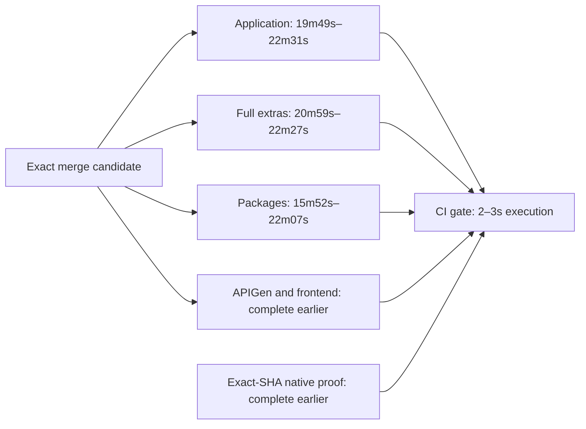

# Remaining merge CI critical path — #520

Profiled 2026-09-08, before the tool-installation follow-up. The deployed Phase 2.3
cohort and exact-SHA eligibility checks are in
[hosted-remediation-measurement.md](hosted-remediation-measurement.md). The older
[critical-path report](ci-critical-path-measurement.md) is the historical baseline,
not the current deployed population.

## Measured critical path

| Merge candidate | Elapsed | Blocking lane | Gap to next lane |
|---|---:|---|---:|
| [34212294501](https://github.com/flidai/leapview/actions/runs/34212294501), superseded PR #537 | 22m02s | Go application | 14s after full extras |
| [34215268411](https://github.com/flidai/leapview/actions/runs/34215268411), final PR #537 | 21m09s | Full extras | 1m09s after application |
| [34215448203](https://github.com/flidai/leapview/actions/runs/34215448203), dependent PR #534 | 22m41s | Go application | 5s after full extras; 24s after packages |

These are three observations on different candidates, not a new p95. The historical
pre-remediation p95 remains **44m40s**. Queue delays are small and the CI gate
executes in 2–3 seconds in this cohort. Security and native proof complete well
before validation, as documented in the linked evidence report.

## Hosted step profile

Durations below use GitHub's attempt-1 job/step timestamps. Queue is
`started_at - created_at`; total excludes that queue. Validation includes SQL
verification, compilation, test processes and package-lane generated/Prometheus
checks. It is not pure test CPU time. Other retains runner transitions and API
rounding; cleanup includes post actions. No timing is inferred from local runs.

| Run | Lane | Queue | Checkout | Setup | Preparation | Validation | Cleanup | Other | Total |
|---|---|---:|---:|---:|---:|---:|---:|---:|---:|
| 34212294501 | Full extras | 4s | 6s | 2m08s | 4m07s | 15m12s | 2s | 3s | 21m38s |
| 34212294501 | Packages | 4s | 6s | 1m55s | 4m00s | 9m48s | 1s | 2s | 15m52s |
| 34212294501 | Application | 4s | 5s | 1m52s | 4m06s | 15m44s | 1s | 4s | 21m52s |
| 34215268411 | Full extras | 3s | 6s | 2m02s | 4m00s | 14m46s | 2s | 3s | 20m59s |
| 34215268411 | Packages | 4s | 7s | 2m00s | 4m02s | 10m08s | 2s | 3s | 16m22s |
| 34215268411 | Application | 4s | 7s | 1m45s | 3m26s | 14m26s | 1s | 4s | 19m49s |
| 34215448203 | Packages | 4s | 7s | 1m55s | 3m24s | 16m17s | 21s | 3s | 22m07s |
| 34215448203 | Full extras | 3s | 6s | 2m17s | 4m07s | 15m04s | 50s | 3s | 22m27s |
| 34215448203 | Application | 4s | 7s | 2m03s | 4m10s | 15m44s | 23s | 4s | 22m31s |

## Commands and resource constraints

Timestamped Task command markers in those nine hosted job logs give these
intervals. They include build/startup costs and dependencies up to the next
command marker; ranges are sample minima/maxima, not percentiles.

| Validation group | Hosted interval | Constraint |
|---|---:|---|
| Four application shards | 2m18s–2m40s | Three concurrent processes on one runner |
| App MinIO integration | 8–10s | Container-backed test |
| PostgreSQL conformance | 11m58s–12m58s | Source-derived package inventory; two concurrent packages |
| Full: UI QA | 4m51s–5m00s | Shared managed server, PostgreSQL and temporary paths |
| Full: critical race qualification | 3m47s–3m53s | Serial package qualification |
| Full: lifecycle/GC conformance | 2m23s–2m26s | Container tests and generated inputs; deployment subtree about 1m49s |
| Full: Go vet | 54–56s | Build/analysis workload |
| Full: package race | 53–54s | Build/test workload |
| Full: deployment contracts | 50–52s | Container lifecycle plus Terraform checks |
| Full: PostgreSQL multinode | 28–29s | Independent qualification, but shares runner resources |
| Full: workload qualification | 26–27s | Race, fuzz and benchmarks |
| Full: MinIO conformance | 7–8s | Shared evidence paths and generated inputs |

For the final PR #537 and dependent PR #534 samples, package validation breaks
into SQL verification/conformance **2m14s / 1m46s**, quality checks **45s / 35s**,
and the package sweep **6m33s / 13m29s**. The sweep's large variation is another
reason not to forecast a fixed partition from these two runners. Both retain the
source-derived exclusions that hand external-service packages to their dedicated
qualification lane.

Splitting only full extras can improve total elapsed by at most the 69-second
gap after application in one sample; application already blocks the other
two samples. Splitting only application has only 5–14 seconds of excess
in its two blocking samples. Splitting both exposes package validation as the next
barrier. These are fixed-timestamp bounds, not forecasts after rescheduling.

Preparation repeats generation and embedded asset builds in each isolated job.
For application job [102025424924](https://github.com/flidai/leapview/actions/runs/34215268411/job/102025424924),
SQL generation spans 10:26:56.072–10:28:12.464 UTC (76s), and schema export spans
10:28:23.418–10:29:22.894 (59s). SQLC deliberately uses Go 1.26.7 while the main
module uses 1.26.8; this profile does not change that generator policy.

The same job restores the primary Go cache key
`setup-go-Linux-x64-ubuntu24-go-1.26.8-7544f7e3474cc558709d4c3f31330f4f76d62ead5362153703da92c1750fb922`,
then downloads tools, SQLC and application dependencies. GitHub's cache API reports
main-branch cache **7364966855**, created 2026-09-05T16:44:48Z, size **24,846,316
bytes**. The post action explicitly declines to save because the primary key hit.
This establishes a small shared cache that is not enriched by these runs;
it does not establish which workflow originally wrote it or the achievable warm
speedup. Cache ownership, scope and publication need a separate design.

## Ranked choices and selected change

Ranked by value for this bounded follow-up, considering global latency, risk and
complexity together:

| Rank | Candidate | Expected global reduction | Risk | Complexity |
|---:|---|---|---|---|
| 1 | Remove unused Buf CLI installation | Avoid a measured 36–49s install interval on each sampled long lane; net savings need hosted confirmation | Low: no command consumes it | Very low |
| 2 | Repair shared Go cache ownership/publication | Potential minutes across all long lanes; not measured yet | Medium: scope, trust, storage and cold-cache behavior need validation | Medium |
| 3 | Split PostgreSQL qualification and independent full groups together, then address package validation | Largest structural opportunity; single-lane changes are capped by nearby blockers | Medium/high: exact coverage, strict aggregates and isolated resources | High; several changes |
| 4 | Parallelize only full extras groups | 0–69s fixed-timestamp bound in this cohort | Medium: CPU/memory and generated-path contention | Medium |
| 5 | Tune queue, gate, or native-proof polling | Negligible here; proofs already ready | Adds complexity without measured benefit | Low/medium |

Only rank 1 is implemented. A repository-wide search found no Buf executable
consumer or Buf configuration; the remaining references were its installation,
two architecture assertions and the toolchain documentation. The Task runner and
all test/generation tools remain installed. No workflow job, dependency, task
command, required check, planner output or gate condition changes.

The removed interval starts at the first Buf download log line and ends when the
serial tool installation action completes. Nine measurements are **36.0, 38.9,
43.0, 43.9, 43.9, 44.6, 45.7, 46.3 and 48.9 seconds**. Shared compiler warming from
the old installation may offset some savings in later commands; this interval is
not a guaranteed whole-workflow reduction. This change alone cannot reach 12
minutes.

## Validation and hosted follow-up

Validation at the implementation checkpoint:

- Full `internal/platform/architecture` and `internal/platform/ci` tests passed;
  these include the hosted workflow contract, planner and gate tests.
- The two changed hosted-setup architecture tests also passed independently.
- Actionlint passed for all seven workflows consuming the shared setup action,
  with the pre-existing unsupported `stacked` activity ignored. A repository-wide
  attempt additionally encountered the installed linter's unsupported
  `macos-15-intel` label and `artifact-metadata` permission in unchanged native
  workflows; those files are outside this diff.
- `bun run docs:validate-diagrams`, `docsitegen --check` and `git diff --check`
  passed.
- `task ci` passed generation, SQLC determinism, vet/diff and SQL audit, then
  stopped at required PostgreSQL conformance because this workspace cannot access
  `/var/run/docker.sock`. No conformance requirement was disabled. The complete
  local CI contract has therefore **not passed**; hosted validation is required.

No after-change merge observation exists yet for this follow-up.

| Population | Hosted elapsed |
|---|---:|
| Pre-#520 historical baseline | 44m40s p95 |
| Deployed #520, before this follow-up | 21m09s, 22m02s, 22m41s observations |
| After unused-tool removal | Pending eligible hosted merge candidate; no measured p95 |

A valid after sample must use the new action at the tested merge SHA and pass the
unchanged CI gate, security gate and exact-SHA native proof. Compare both the
installation step and total elapsed; do not attribute differences in source,
runner scheduling or cache state to this change. Follow with multiple candidates
before drawing a p95 conclusion. The next substantial engineering investigation
is shared preparation/cache ownership, followed by coordinated lane decomposition
if profiling still shows PostgreSQL and full extras dominating.
