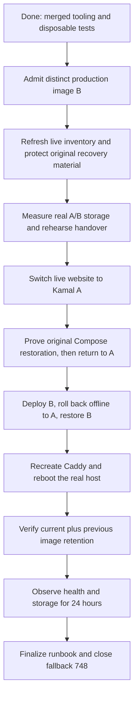

# Live public-website Kamal rollout: remaining plan

Updated: 29 September 2026.
Scope: `leapview.dev` and its `www` redirect. The product demo/NixOS deployment is separate.

## Objective

Move the live public website from its original Compose application to the merged
manual Kamal deployment process. Keep Caddy serving HTTPS, prove recovery to a
working version, and prevent website images from filling the server disk.

Completion means verified A/B deployment and offline rollback, demonstrated
original-Compose restoration, successful Caddy recreation and real host reboot,
bounded image retention, and 24 hours of recorded healthy operation.
Automatic VPS activation remains disabled. Merging code or publishing an image
alone does not complete the live migration.

## Verified starting point

| Item | Status / evidence |
| --- | --- |
| Manual operator, #752 | Merged as `4c1fb0a0786cb693169d603bb2c021c175dd1152`. Provides admission, ownership, storage checks, deployment, rollback, recovery and maintenance. |
| Trial and failure qualification, #751 | Merged as `efefe8178e6fd78498c3f4cb52a379658f67618d`. Final [merge validation](https://github.com/flidai/leapview/actions/runs/36556552195), security and Electron checks passed. |
| Undo-test reliability, #770 | Merged as `bc07df37e6041b07558f1e0e06a41cb8ba966102`. |
| Failure testing | 39 operator tests and expanded disposable lifecycle qualification passed. Real interrupted pulls/switches, lost responses and offline recovery were exercised. These are not production cutover or host-reboot results. |
| Image A | Production workflow [36538460625](https://github.com/flidai/leapview/actions/runs/36538460625) passed; independent operator `prepare` passed. Source: `bc07df37e6041b07558f1e0e06a41cb8ba966102`. |
| Image B | Post-#751 workflow [36558423631](https://github.com/flidai/leapview/actions/runs/36558423631) succeeded, and independent operator `prepare` passed. Source: `efefe8178e6fd78498c3f4cb52a379658f67618d`. |
| Live website | No production migration was performed during this work. Last host inventory was 29 September at 03:53 UTC: original Compose/Caddy, updater inactive, no permanent Kamal handover. This is historical inventory, not a fresh runtime check. |
| Demo | Latest reviewed [demo deployment](https://github.com/flidai/leapview/actions/runs/36553961368) passed. User reports NixOS rollout; leave the demo untouched. |
| #748 | Open, uninstalled old Compose/updater fallback. Do not merge/install it alongside Kamal; close only after final migration acceptance. |

The local aggregate `task ci` reports watchdog limitation remains historical
validation evidence; it was not turned into a local pass. The PRs were approved
and merged after the limitation was disclosed and required hosted checks passed.
See [the receipt](deploy/kamal-site/evidence/local-ci-20260929.md).

Image A's immutable reference:

```text
ghcr.io/flidai/leapview-site@sha256:cced827fce58ebbccc2c293da65741c08e0108cbd017d46841f7ea87dcf78387
```

Its mode-0600 record and evidence are saved locally under
`/home/codex/tmp/leapview-kamal-study/production-image-a-36538460625/`:
`site-a-record.json`, workflow metadata/artifact, prepare log and checksums.
Preserve these in durable protected operator storage before rollout; a temporary
workspace directory is not the sole long-term recovery store.

Image B: `ghcr.io/flidai/leapview-site@sha256:093b718bcb51bd23e334497cc279f09367a26bbce0126956377d3ba5f612c14c`.
Its protected record and admission evidence are under
`/home/codex/tmp/leapview-kamal-study/production-image-b-36558423631/`.
Both images are admitted; real-image storage qualification and live migration
remain pending. The reviewed restore-B command below uses the recorded rollback
path rather than trying to redeploy the recorded prior version.

## Execution flow



Proceed in order. A failed exit check blocks the next phase. Existing approval
authorizes this rollout plan; normal repository protections still apply to any
new code fixes. Do not substitute an image or expand scope to bypass a failed gate.

## 1. Select and admit the two production images

- [x] Merge the operator and trial PRs; verify publish-only production workflow.
- [x] Admit A and preserve its exact index, amd64 manifest, config, source revision,
  release metadata, provenance/SBOM and vulnerability-policy evidence.
- [x] Wait for the complete post-#751 production-image workflow to succeed.
  If it fails, diagnose/fix it and use a successful eligible main build.
- [x] Download its qualification artifact and run the merged operator's live
  admission for a distinct image B. Do not use a trial-package image or mutable tag.
- [x] Confirm A and B are distinct immutable production images with the required
  service ownership label and source-specific release/download metadata.
- [ ] Pin the tested operator checkout and locked tooling. Recheck admission and
  policy freshness before deployment; preserve records for both selected images.
  If an image must be replaced, repeat its storage qualification too.

From a checkout containing the merged operator, with the documented pinned tools
and existing authenticated GitHub CLI:

```sh
task site:deploy -- prepare --image ghcr.io/flidai/leapview-site@sha256:FULL_B_DIGEST
```

`FULL_B_DIGEST` is a placeholder to replace with the successful workflow's exact
artifact identity. `prepare` verifies registry/workflow evidence and writes a
protected local record; it does not switch the production website.

**Exit:** two valid protected admission records, traceable to successful main
production workflows, with all referenced artifacts retained.

## 2. Refresh the live baseline and protect original recovery material

- [ ] Use the existing site SSH credential, route and pinned host fingerprint.
  Record UTC time, host boot ID, OS, architecture and Docker/containerd versions.
- [ ] Check HTTPS, health/readiness, source/build identity, docs, release metadata,
  download links, CSS/JS and the `www` redirect. Capture the actual running image.
- [ ] Inventory Docker/containerd backing paths, filesystem devices, free bytes,
  free inodes, site containers/images, Caddy image/config/mounts and restart policies.
  Do not reuse the old approximately 32.3 GiB free-space observation as current capacity.
- [ ] Confirm the legacy updater timer/service remain disabled/inactive, old
  mutating workflow runs are settled, and neither an unresolved owner journal nor
  surviving remote work exists. Acquire locks in the documented order.
- [ ] Preserve protected original Compose, Caddyfile, deployment environment,
  exact image identities and container inspections outside the routine deployment
  directory. Preserve certificates/config volumes and required local images.
- [ ] Write and verify exact restoration commands, including how to regain SSH
  after a reboot. Keep secret-bearing material out of Git, PRs and public logs.

The old snapshot showed live release `0.2.0-rc.1` while main expected
`0.3.0-alpha.1`. Refresh both values; validate against the selected image's actual
release metadata rather than treating either historical value as the target.

**Exit:** timestamped live baseline and usable protected original-site recovery
material. Any unexpected host change is understood before mutation.

## 3. Measure real storage and rehearse the exact handover

Storage here means the website server's Docker image/container disk usage and
file-count capacity (inodes), not customer datasets or demo storage.

- [ ] Use disposable storage/runtime matching the refreshed production setup.
  Exercise the actual admitted A/B images, including cold pulls, shared layers,
  extraction, boot, acceptance, rollback and cleanup.
- [ ] Measure peak incremental bytes/inodes for each distinct Docker/containerd
  filesystem. Include temporary overlap with the original Compose recovery image,
  A, B, proxy and Caddy; measure both cold and warm-cache cases.
- [ ] Save raw samples, filesystem identity/capacity, exact image identities,
  runtime/tool versions, commands and outcomes. Synthetic fixture measurements
  and compressed download sizes alone are insufficient.
- [ ] Populate each capacity record's `paths`, `qualified_images`, measured peaks,
  compressed-size envelope and derived margins:
  - Candidate byte headroom: at least `ceil(1.5 × measured_peak_bytes)`.
  - Byte reserve: at least `max(2 GiB, ceil(10% × filesystem capacity))`.
  - Inode reserve: at least `max(10,000, 2 × measured_peak_inodes)`.
  - Before pulling: free bytes must cover headroom plus reserve, and free inodes
    must cover the measured incremental peak plus inode reserve.
- [ ] Rehearse the exact bootstrap, timed restoration safeguard, Caddy switch,
  public acceptance and original-Compose restoration sequence. Choose and record
  the safeguard deadline from the measured rehearsal before touching production.
- [ ] Verify sufficient live capacity with recovery images retained. If it does
  not fit, stop and revise the plan; do not prune the only rollback or expand disks
  as an unreviewed shortcut.

**Exit:** A and B explicitly capacity-qualified, live headroom sufficient, and a
rehearsed cutover/restoration procedure with a defined timeout.

## 4. Perform controlled live handover to A

Bootstrap is a separate migration step: routine `deploy` expects valid permanent
readiness/state. Do not fabricate `ready.json` or mark handover complete just to
make the normal deploy command run.

- [ ] Under exclusive ownership, bootstrap the persistent Kamal network and the
  runbook's pinned private proxy with its restart policy and no public proxy ports.
- [ ] Start admitted A privately and verify its actual runtime/build identity.
  Keep the original Compose application and image available for restoration.
- [ ] Install the guarded legacy entrypoints and active Caddy-only Compose/Caddy
  configuration, preserving public ports, certificates and persistent mounts.
- [ ] Arm the rehearsed timed restoration safeguard, switch Caddy to Kamal, and
  continuously probe public availability. Record start/end and any interruption;
  zero downtime is not assumed.
- [ ] Validate HTTPS, health/readiness, image/build identity, docs, release metadata,
  download URLs, assets and `www`. Run the public installation smoke check against
  the intended release metadata without weakening version comparisons.
- [ ] Demonstrate restoration to the protected original Compose configuration,
  verify it publicly, then return to A and repeat acceptance checks.
- [ ] Only after success, persist verified topology hashes, capacity qualification,
  active record and permanent handover state. Confirm the updater remains disabled.

**Exit:** A serves publicly through persistent Caddy/Kamal, original-site
restoration has succeeded, and permanent state reflects verified reality.

## 5. Prove deployment, rollback and host restart

- [ ] Deploy B through the operator and save public acceptance evidence.
- [ ] From a fresh operator session, block registry access for the tested path,
  roll back locally to retained A, and verify it publicly. Scope the block so SSH,
  public probes and unrelated services remain available; remove it afterward.
- [ ] Confirm the recorded state is active=A and prior=B, then run `rollback`
  again to restore B. Repeat public acceptance and verify active=B, prior=A.
  Do not use `deploy --record B` while B is the recorded prior version: the
  operator rejects that path and requires the recorded rollback operation.
- [ ] Confirm the final tool/source hashes still match the tested interrupted-work
  and broken-current recovery evidence. Repeat affected disposable scenarios if
  tooling changed; do not add unnecessary destructive live failure injection.
- [ ] Recreate Caddy using the active Caddy-only Compose definition. Verify HTTPS,
  persistent certificates, topology and absence of a recreated legacy app.
- [ ] Reboot the real website host in the controlled rollout window. Verify SSH
  recovery, application/proxy identity, restart policies, network, public checks,
  state records and updater inactivity. A Docker restart does not satisfy this.

After phase 4 establishes verified permanent state, the routine commands are:

```sh
task site:deploy -- status
task site:deploy -- deploy --record /absolute/protected/path/to/B-record.json
task site:deploy -- rollback
# Confirm status reports active=A and prior=B before restoring B:
task site:deploy -- status
task site:deploy -- rollback
# Confirm public acceptance and recorded active=B, prior=A:
task site:deploy -- status
```

**Exit:** B is serving, A is locally recoverable, offline rollback and Caddy
recreation passed, and a real host reboot recovered the intended topology.

## 6. Settle image retention and observe for 24 hours

- [ ] After restoration/restart acceptance, remove only verified migration-only
  application resources. Preserve unrelated images/containers, Caddy data and
  protected configuration/audit records. Do not use blanket system/volume pruning.
- [ ] Run operator maintenance and verify its owned application image set is
  exactly current B plus distinct verified prior A, with required recovery material.
- [ ] Record final capacity, digests, retained resources and baseline disk/inodes.
- [ ] Start a timestamped 24-hour observation after the final planned mutation.
  Probe public HTTPS/health/readiness every minute; sample disk/inodes, service
  health and restart counts every 15 minutes. Check build identity and release/
  download smoke behavior at the start and end and after any recovery action.
- [ ] Preserve timestamped results and monitoring gaps. Investigate failed probes,
  unexpected restarts, persistent image growth or reserve breaches. Notify on a
  meaningful failure/change; healthy repeated samples need no user notification.
- [ ] Require a complete 24-hour stable period with no unresolved failure. Restart
  the period after a deployment, rollback or corrective production mutation;
  an unobserved interval does not count as successful monitoring.

**Exit:** recorded 24-hour health/storage acceptance with no unresolved deployment
or maintenance problem and adequate measured capacity margins.

## 7. Close out

- [ ] Update the operator runbook and this plan to match the actual host. Record
  A/B identities, source revisions, release versions, tooling, protected recovery
  locations, capacity margins, commands and observed interruption durations.
- [ ] Attach sanitized qualification, cutover, rollback, reboot and observation
  evidence; preserve secret-bearing originals only in protected operator storage.
- [ ] Close [#748](https://github.com/flidai/leapview/pull/748) as superseded,
  linking the merged replacement and successful live acceptance evidence.
- [ ] State explicitly that deployment remains operator-controlled. Treat any
  future automatic deployment proposal as separate work.

## Failure handling and scope boundaries

| Condition | Required response |
| --- | --- |
| Admission, ownership, topology, recovery material or capacity uncertain | Stop before pulling/switching; investigate and re-establish verified prerequisites. |
| A fails initial public acceptance | Restore the protected original Compose site using the rehearsed safeguard; verify it before retrying. |
| Candidate B rejected | Restore verified A and check public health before any cleanup. |
| Cleanup fails after B was accepted | Keep B serving; use explicit maintenance recovery. Do not undo a healthy acceptance merely because cleanup failed. |
| SSH disconnects or an acceptance response is lost | Treat ownership/outcome as unresolved. Fence the old controller, inspect surviving work and actual state, then use the runbook's recovery path. Never clear locks based only on elapsed time. |
| Reboot/public checks fail | Recover using the saved topology/configuration and locally retained images; record the interruption and postpone acceptance. |

Do not change the demo/CFO deployment, DNS, disk size, registry credentials or CI
network identities as part of this plan. Do not install #748 beside Kamal or
re-enable the retired updater. Use the existing pinned access path and the
[operator recovery procedure](deploy/kamal-site/README.md) for mutations.

## References

- [Accepted completion requirements](deploy/kamal-site/completion-plan.md)
- [Manual operator, capacity and recovery runbook](deploy/kamal-site/README.md)
- [Qualification evidence](deploy/kamal-site/evidence/README.md)
- [Merged operator PR #752](https://github.com/flidai/leapview/pull/752)
- [Merged trial PR #751](https://github.com/flidai/leapview/pull/751)
- [Merged Undo-test fix #770](https://github.com/flidai/leapview/pull/770)

Earlier runbooks can retain historical draft/pre-merge wording. The verified
starting-point table above supersedes those stale status statements; their
technical recovery and acceptance requirements still apply.
